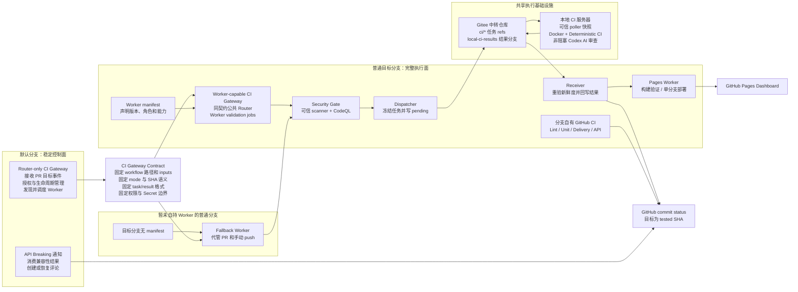
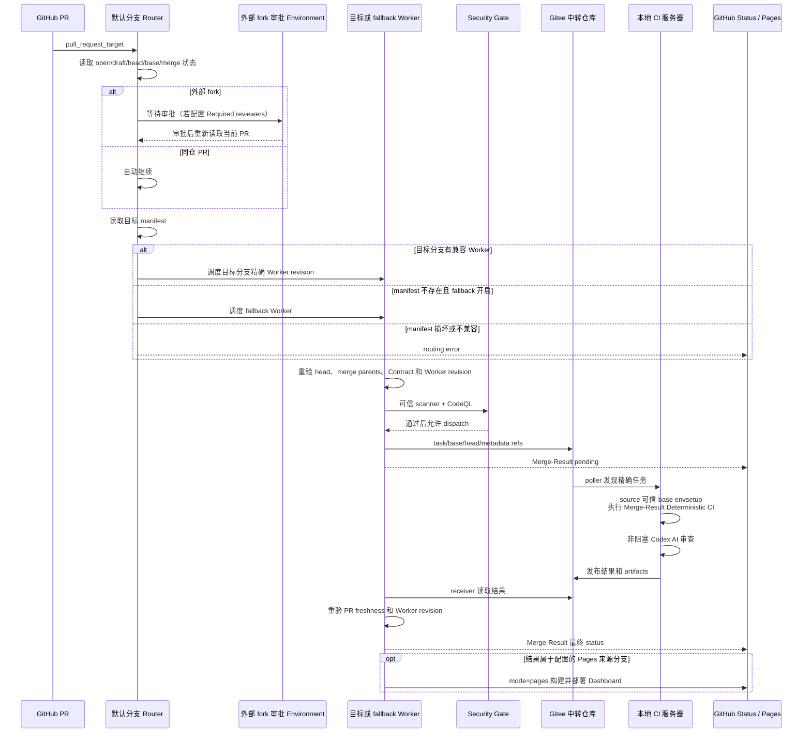
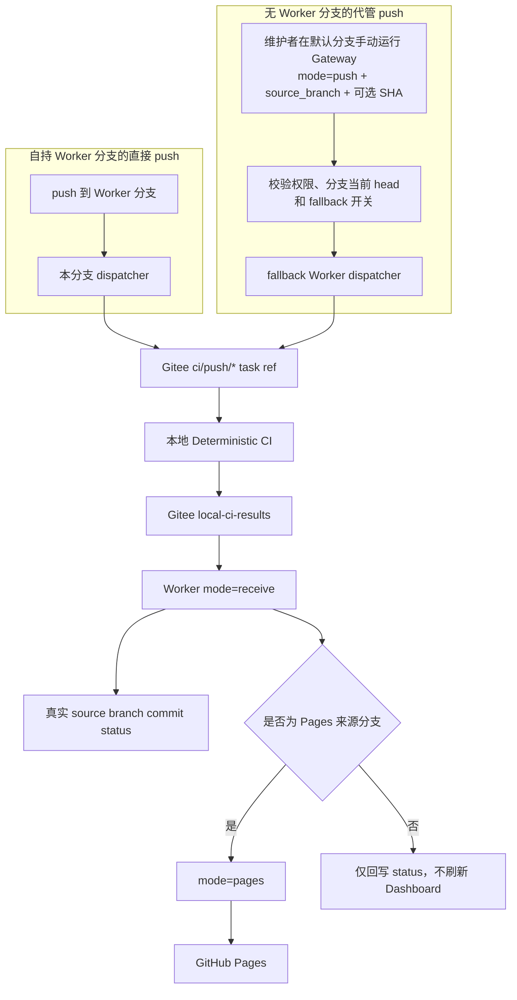

# 多分支 CI 架构、链路与责任边界

本文从整体架构、调用链路和维护边界三个角度说明当前多分支 CI。文档使用“默认分支”“普通目标分支”和“fallback Worker 分支”等通用角色名称，不绑定具体开发分支。

更细的 Gateway Contract 字段、生命周期和接入规则见 [multibranch_ci_gateway_zh.md](multibranch_ci_gateway_zh.md)；部署、服务器配置和故障排查见 [ci_guide_zh.md](ci_guide_zh.md)。

## 设计目标

CI 被拆成默认分支控制面和普通目标分支执行面：

- 默认分支提供稳定且可信的跨分支入口，负责授权、路由、契约检查和生命周期控制。
- 普通目标分支持有完整 Worker，执行本分支的安全扫描、任务投递、结果接收和页面构建。
- 不同普通目标分支可以独立微调测试内容，但必须遵守统一 Gateway Contract。
- 暂未持有 Worker 的分支可以由 fallback Worker 临时代管，不要求一次性迁移所有分支。
- 候选代码不在默认分支 Router 中执行，Gitee Secret 只进入 Worker 执行链。

这套设计允许不同开发者维护各自分支的 CI，同时避免分支自行改变输入字段、SHA 语义、授权方式或 Secret 边界。

## 总体架构



## 架构角色与边界

| 角色 | 负责 | 不负责 |
| --- | --- | --- |
| 默认分支 Router | 接收 `pull_request_target`、同仓自动路由、外部 fork 审批、Worker 发现、状态初始化、取消与重新路由 | 不 checkout 或执行候选代码，不读取 `GITEE_TOKEN`，不持有 scanner 和本地 runner |
| 普通目标分支 Worker | 校验请求、Security Gate、dispatcher、receiver、Pages、分支自有 GitHub CI | 不修改默认分支授权规则，不绕过 Contract 接收请求 |
| fallback Worker | 代管无 manifest 分支的 PR；按维护者请求代跑其他分支精确 push SHA | 不替代目标分支普通 GitHub CI，不用跨分支结果覆盖 Dashboard |
| Gitee 中转仓库 | 保存 task/base/head/metadata refs 和 Local CI 结果 | 不决定 PR 是否授权，不执行代码，不负责 GitHub 路由 |
| 本地 CI 服务器 | 发现任务、固定可信 runner、执行 Merge-Result、发布结果和 Codex 报告 | 不决定 Worker 选择和 PR 授权 |
| GitHub Pages | 展示指定生产来源分支的后端、性能和全量算子结果 | 不作为 Local CI 是否通过的唯一门禁 |

## 文件与职责

同一路径的 `ci-gateway.yml` 在默认分支和普通目标分支中保持相同 Contract 和公共 Router jobs；普通目标分支版本在此基础上增加 Worker jobs。

| 文件或目录 | 默认分支职责 | 普通目标分支职责 |
| --- | --- | --- |
| `.github/workflows/ci-gateway.yml` | Router-only Gateway：授权、Worker 发现、PR 生命周期、手动 push 路由和失败状态 | Worker-capable Gateway：保留公共 Router，并实现 `dispatch`、`push`、`receive`、`pages`、`cancel` |
| `.github/workflows/api-breaking-notify.yml` | 消费 Public API Compatibility artifact，创建、更新或恢复通知 | 可以保留副本，但系统只依赖默认分支监听器 |
| `.github/ci-gateway-manifest.json` | 不持有；Router 从目标 commit 读取 | 声明 Gateway Contract、`worker` 角色、Merge-Result 和 capabilities |
| `.github/workflows/security-gate.yml` | 不持有、不扫描候选代码 | 使用精确 Worker revision 上的 scanner 和 CodeQL 阻止不可信 dispatch |
| `.github/workflows/dispatch-local-ci.yml` | 不持有 | 创建 task/base/head/metadata refs，写 pending，并启动 receiver continuation |
| `.github/workflows/receive-local-ci-result.yml` | 不持有 | 等待结果，重验 PR 和 Worker revision，向 tested SHA 写最终状态，按策略请求 Pages |
| `.github/workflows/backend-status-pages.yml` | 不持有 | 同步结果并验证 Dashboard；仅配置的 Pages 分支允许部署 |
| `.github/workflows/ci_basic.yml` | Router-only 形态不依赖 | 分支自有 Lint、格式检查和纯 Python 单元测试 |
| `.github/workflows/delivery-ci.yml` | Router-only 形态不依赖 | 分支自有 Delivery 预检、性能契约和可选 full smoke |
| `.github/workflows/api-compat.yml` | Router-only 形态不依赖 | 生成 Public API Compatibility 结果 artifact |
| `scripts/ci/` | 不持有 scanner 和 Worker 实现 | Security scanner、构建和 Delivery 脚本及 Gateway 契约测试 |
| `scripts/local_ci/` | 不执行本地测试 | Poller、可信 runner、Codex AI、结果发布和 GitHub 状态桥接 |
| `scripts/dashboard/`、`dashboard/` | 不构建页面 | 结果同步、数据契约和 Dashboard 静态资源 |

目标分支 manifest 不存在时才允许 fallback。manifest 已存在但 JSON 损坏、Contract 不兼容、能力不足或必要文件缺失时必须失败，不能静默换用 fallback。

## Gateway 的工作

`ci-gateway.yml` 是统一入口、路由器和契约实现，不是实际测试执行者。

| Gateway 工作 | 说明 |
| --- | --- |
| PR 路由 | 默认分支读取 PR 当前状态和目标分支，选择目标分支 Worker 或 fallback Worker |
| 外部 fork 审批 | 外部 fork 进入配置的 Environment；审批后重新读取当前 head 和 Merge-Result，授权不会沿用到新的 head |
| Merge-Result 冻结 | 解析 GitHub merge ref；第一父提交作为 comparison base，第二父提交必须对应授权 head |
| Worker 校验 | 检查精确 Worker commit 的 manifest、Contract、capabilities 和必要文件 |
| 模式分流 | 根据 `dispatch`、`push`、`receive`、`pages`、`cancel` 调用对应 Worker 链路 |
| 状态控制 | 在投递前写 pending；校验失败写 error；receiver 写最终 success、failure 或 error |
| 生命周期控制 | force-push、retarget、close 和 draft 时取消旧 receiver，阻止旧结果覆盖新任务 |
| Pages 隔离 | 所有 Worker 可构建验证，但只有配置的来源分支可以部署生产 Dashboard |

真正执行代码的是：

```text
Gitee 中转仓库 -> 本地 poller -> 可信 runner 快照 -> Docker / 本地环境
```

## PR 自动链路



### PR task metadata

Dispatcher 在 Gitee metadata ref 中保存 `task-metadata.json`，冻结本次 PR 的标题、描述、base/head/tested SHA、分支、仓库和 Worker revision。Local CI 校验后将它提供给 Codex AI，避免使用已变化的 PR 描述或不可信候选文件。

标题最多保存 500 个字符，描述最多保存 8000 个字符；`title_truncated` 和 `description_truncated` 明确记录原文是否被截断。metadata 不可用时 Deterministic CI 继续运行，但 Codex AI 的贡献者目标判断会降级。

## Push、结果接收与 Pages 链路



fallback push 不是自动监听所有普通分支。维护者必须从默认分支 Gateway 手动选择 `mode=push` 并填写真实 `source_branch`；可选 `requested_sha` 用于防止分支在点击运行后漂移。

## Gateway Contract 固定内容

Router 与 Worker 的 `.github/workflows/ci-gateway.yml` 必须保持相同事件、`workflow_dispatch.inputs`、公共 Router jobs 和调用约定。Worker 是 Router 公共部分的严格超集。

### 固定 mode

| mode | 含义 |
| --- | --- |
| `dispatch` | 校验并投递 PR Merge-Result |
| `push` | 由 fallback Worker 代跑指定分支当前精确 head |
| `receive` | 继续等待已知 task ref，并在回写前重验新鲜度 |
| `pages` | 构建验证 Dashboard；仅配置分支部署 |
| `cancel` | 停止旧 receiver，并按清理者规则删除 relay refs |

### 固定 SHA 语义

| 字段 | 含义 |
| --- | --- |
| `expected_head_sha` | 获得授权的 PR head，用于 force-push 和新鲜度校验 |
| `comparison_base_sha` | GitHub Merge-Result 的第一父提交，用作性能比较和可信 envsetup 来源 |
| `tested_sha` | 实际执行提交和 Required status 目标；PR 为 Merge-Result，push 为分支 head |
| `requested_sha` | 手动 push 的可选防漂移值 |
| `worker_revision_sha` | 执行 Gateway、scanner、dispatcher 和 receiver 的精确 Worker 版本 |

### 固定 refs 与结果

| 类型 | 格式或约束 |
| --- | --- |
| PR task | `ci/pr-<PR号>/<source-branch>` |
| PR base | `ci/base/pr-<PR号>/<source-branch>` |
| PR head | `ci/head/pr-<PR号>/<source-branch>` |
| PR metadata | `ci/meta/pr-<PR号>/<source-branch>`，内容遵循任务 metadata 协议 |
| Push task | `ci/push/<source-branch>` |
| Full task | `ci/full/<source-branch>` |
| 结果分支 | `local-ci-results`，目录遵循结果路径契约 |

## Required status 语义

PR 的 pending、success、failure 和 error 主状态统一写到 `tested_sha`，即本次真实执行的 Merge-Result SHA。状态说明同时显示 Merge-Result 短 SHA，便于和 Gitee 结果目录及 Actions 任务对应。

只有在尚未取得可用 Merge-Result、无法把状态写到 tested SHA 的早期路由失败中，才向 PR head 写独立的 `<context>/routing` 诊断状态。阶段状态可以单独展示，但不能替代主 Required status。

## 生命周期与清理

| 事件 | 行为 |
| --- | --- |
| PR force-push | 旧审批和旧 receiver 失效；新 head 重新路由和审批；旧结果不得覆盖新 Merge-Result |
| PR retarget | 同时通知旧目标 Worker 和 fallback Worker 取消，再按新目标重新选择 Worker |
| PR close | 取消等待任务、写诊断状态并清理未消费 refs |
| PR 转 draft | 与 close 类似地停止当前 Local CI，恢复 ready 后再重新路由 |
| Worker revision 变化 | 旧 receiver 发现 revision 不一致后停止回写 |
| task ref 被新任务覆盖 | 清理逻辑必须验证任务身份，不能误删同名新任务 |

## 安全与 Secret 边界

- 默认分支 Router 只使用 GitHub 提供的权限，不读取 Gitee Secret。
- Router 不 checkout PR head，也不运行 PR 中的脚本。
- Security Gate 和 scanner 固定来自已验证的 `worker_revision_sha`。
- 外部 fork 审批绑定审批时重新读取的 head 和 Merge-Result；后续 force-push 必须重新授权。
- PR supervisor 使用精确 comparison base commit 的可信 `envsetup.sh`；候选版本只做独立检查。
- Dispatcher 在 Security Gate 通过后才能获得 Gitee 写权限并投递任务。
- 本地 runner 必选阶段 fail-closed；缺失、`not_run`、`running` 或失败都不能产生整体 success。

## 普通目标分支可以独立调整的内容

- 测试阶段、测试命令和超时。
- 后端类型、构建参数和环境初始化方式。
- FlagGems sample/full 范围、白名单和失败策略。
- compile-time、pass-profile、IR serialization 指标与 warning 阈值。
- Codex AI 提示词、非阻塞报告内容和定向测试预算。
- 分支自有普通 GitHub CI、Delivery CI 和 API compatibility 细节。

以下内容不能由单个普通分支自行改变：Gateway inputs、调用约定、SHA 含义、授权规则、task/result ref 格式、Required status 目标和 Secret 边界。

## 接入新普通目标分支

1. 从兼容 Worker 复制完整 Gateway、manifest 和必要 Worker workflows。
2. 在 manifest 声明 Gateway Contract、`worker`、`merge-result` 和实际 capabilities。
3. 保持公共 Router jobs 与 inputs 不变，只调整分支自有 Worker 或普通 CI 实现。
4. 运行 Gateway 契约、Security scanner、Local CI、结果和 Dashboard 测试。
5. manifest 合入后，默认分支会自动从 fallback 切换到该分支自己的 Worker。

升级公共 Contract 时必须先部署兼容 Worker，再升级默认分支 Router，避免 Router 发出普通分支尚不能理解的请求。

## 关键部署策略

| 配置 | 作用 |
| --- | --- |
| `LOCAL_CI_FALLBACK_WORKER_BRANCH` | 指定暂时代管无 Worker 分支的可信 Worker |
| `LOCAL_CI_FALLBACK_PR_ENABLED` | 是否允许 PR 自动 fallback，默认启用 |
| `LOCAL_CI_FALLBACK_PUSH_ENABLED` | 是否允许维护者手动跨分支 push 代管，默认启用 |
| `LOCAL_CI_PAGES_BRANCH` | 唯一允许部署生产 Dashboard 的分支 |
| `LOCAL_CI_FORK_APPROVAL_ENVIRONMENT` | 外部 fork 审批 Environment；配置 Required reviewers 后才形成强制人工门禁 |

代码默认值只提供初始策略；仓库 Variables、Environment、分支保护、Secrets 和生产服务器配置仍需由仓库管理员完成。
