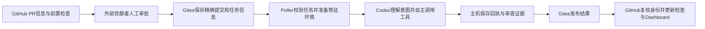

# CI 使用与维护指南

本页是项目唯一的 CI 主指南。日常使用、服务器配置、故障恢复和扩展规则均从这里开始；目录内 README 只说明入口或具体参数。

## 工作链路

`main` 保留必要的 GitHub 事件入口和调度，`ci_repo` 保存完整工作流、Local CI 与 Dashboard 控制程序。普通源码分支通过受信配置选择对应 Triton 环境。



同仓贡献通过前置检查后自动继续；外部贡献者 PR 进入 `local-ci-fork-approval` environment，由维护者审批。审批绑定当前 head、base 和被测合并提交，force-push 后不能沿用旧审批。缺少有效任务信息、前置检查或审批时不能投递成功任务。

| 身份 | 用途 |
| --- | --- |
| `head_sha` | PR 作者提交，绑定审批和后续变更检测 |
| `base_sha` | 本次比较基线 |
| `tested_sha` | 实际被测提交；PR 使用合并结果，push 使用分支提交 |
| `worker_revision_sha` | 本次受信 GitHub 与主机控制程序的精确提交 |

Gitee 保存代码和任务信息，不决定是否授权。Poller 在执行期间检查任务是否仍有效；PR 关闭、转 draft、换目标分支或提交变化后，旧结果不能覆盖新任务。配置的 worker 不兼容或信息损坏时明确失败；不能为了继续执行而静默换用其他控制程序。

## 最低检查与 AI 调度

主机计算最低检查集合，Codex 根据 PR 意图、标签和真实代码影响选择其余检查，并说明选测和未执行原因。审查、构建和定向验证可以交错进行，工具依赖只表达必要产物。

| 变更 | 最低范围 |
| --- | --- |
| 纯文档 | 免构建，完成有源码依据的架构审查 |
| 编译器代码或打包 | 环境、Frontend build、安装/import、Frontend smoke、架构审查 |
| 前端代码或测试 | 在上述范围上追加相关 Frontend tests |
| 后端、lowering、pipeline 或影响不明 | 执行全部适用检查 |
| CI 控制面 | 环境、控制面测试、架构审查；混合变更叠加相应编译器检查 |
| 手动 FlagGems 全量 | 全部适用检查与全量算子集合 |

工具包括环境、前端构建/安装/测试/smoke、后端构建/安装/测试/smoke，以及 FlagGems、编译耗时、Pass profiling、IR serialization。前后端 build 都只依赖环境；后端 install 使用本任务后端 wheel，并依赖前端 install 完成 Triton 后端发现。tests 与 smoke 互不依赖。具体工具 ID、依赖和参数见 [工具说明](../scripts/local_ci/tools/README.md)。

只有 Triton 3.0 具有后端、算子及性能能力；其他版本明确记录相应检查不适用。3.0 缺少 SDK、后端或测试配置是环境错误，不能改写为“不适用”。FlagGems 默认按影响选择算子；不能可靠缩小时覆盖已有可运行集合，全量模式保留手动触发。测试未执行、命令失败、超时或 OOM 都不能写成通过。

性能测量必须真实执行。基线须匹配比较提交、profile、LLVM 和内容哈希；没有可信基线时只报告候选测量。耗时变化用于诊断，不单独阻塞合入；测量命令失败仍阻塞。

Codex 使用受信主机配置的 `gpt-5.5` 模型和 `high` 推理强度。其编排入口为 [ai_ci_program.md](../scripts/local_ci/ai_ci_program.md)。它可以调整当前任务的计划、并行度和辅助用例；长期规则、基础工具、架构契约和生产配置的修改交由维护者采纳。

## 查看与触发任务

PR 的四项必要检查是 `local-ci/basic`、`local-ci/api`、`local-ci/security`、`local-ci/summary`。仓库分支保护必须实际要求这些检查；工作流文件存在并不等于门禁已启用。其他既有必要检查按仓库保护规则保留。

自动 PR 和 push 任务由 GitHub 工作流投递。手动验证从 `main` 的 `ci-gateway.yml` 入口选择 `mode=push`、`source_branch=<目标分支>`，需要固定提交时填写 `requested_sha`；FlagGems 全量另设 `flaggems_mode=full`。不要在 Gitee 手工伪造 task metadata。手动入口仍校验权限、提交身份和环境能力。

Dashboard 展示工具选择、未执行原因、AI 架构审查与发现、阻塞项、性能变化、命令日志和 worker 健康。以 `task_id`、`run_id` 和 `tested_sha` 对照 GitHub 检查与结果，不能只凭页面颜色判断是否测试了当前 PR。

## 主机与 GitHub 配置

从 [config.example.json](../scripts/local_ci/config.example.json) 生成主机配置，实际凭据和部署值保存在仓库之外。安装步骤见 [部署入口](../scripts/local_ci/deploy/README.md)。生产执行关闭 `local_acceptance`，控制文件必须与冻结 worker revision 一致；不应在正在执行任务时更新其只读挂载的控制目录。

| 配置 | 必须落实的内容 |
| --- | --- |
| `control_root` | 维护者管理的 `ci_repo` checkout；完整控制文件与受信提交一致 |
| `state_dir` | 主机租约、结果、发布重试和通知状态，不挂载给候选代码 |
| `workspace_host` | 统一任务根目录；各版本固定容器挂载为 `/workspace` |
| `profiles` / `branch_profiles` | Triton 版本、固定容器名、可信镜像/配方、LLVM 与真实目标分支映射 |
| `dependency_sources` | 所需 Triton/FlagGems 依赖的受信本地 Git 源；按精确 gitlink 检出 |
| `profile.tools` | 前后端测试根、后端 checkout/JIT 命令、FlagGems 路径及性能配置；`backend_env_scripts` 只为后端/算子/性能加载 SDK 环境 |
| `codex` | 独立认证文件、`model: gpt-5.5`、`reasoning_effort: high`、命令与时间预算 |
| `relay` | 明确的新 Gitee 仓库 URL、结果分支和凭据环境变量名 |
| `smtp` | SMTP 服务与指定 Gitee 用户对应的真实收件邮箱，不能使用用户名代替邮箱 |

容器只读挂载 **主机 `control_root/scripts/local_ci` 到 `/opt/anchor-ci`**。测试以 UID 1000 执行，Codex 使用 UID 1001；共享 seed `/opt/ci-venv` 和控制程序由 root 所有，候选包只安装到本任务环境。Python 测试和子进程通过受信 `runtime/task_python` 入口，可信预检使用系统 Python `-I -S`。主机 Docker socket、Gitee/GitHub 凭据不进入候选容器。

LLVM 从本次精确代码中的 `triton/cmake/llvm-hash.txt` 读取；若 Triton 是 gitlink，则读取其精确 Git 对象。首次部署需准备可读取该对象的受信依赖源。LLVM 变化只调用主机受信配方，不执行 PR 提供的环境脚本；成功选择持久保存，完整 profile 配置更新后旧选择失效。

GitHub Actions 与主机必须指向同一个新 Gitee relay。配置投递/读取凭据、`local-ci-fork-approval` 的 Required reviewers、四项必要检查、Pages 来源分支及独立 watchdog。`main` 的定时入口转发给 `ci_repo` 实现；普通源码分支不需要复制完整 CI 实施。

## 日常维护与恢复

每个 Triton 版本只使用固定常驻容器，任务之间复用。每日维护在配置的 UTC 窗口内先排空已有任务，检查磁盘并按受信配方重建，以同一固定名称替换容器；失败保留或恢复旧容器。不同版本错峰，构建还受全局锁保护。`--force` 仅绕过时间窗口，不能绕过租约或空间检查。

```sh
python3 -m scripts.local_ci.maintenance --config /etc/anchor-ci/config.json inspect
python3 -m scripts.local_ci.maintenance --config /etc/anchor-ci/config.json rebuild
python3 -m scripts.local_ci.maintenance.health --config /etc/anchor-ci/config.json --dry-run
journalctl -u anchor-ci-poller -u anchor-ci-maintenance
```

| 状态或问题 | 操作与含义 |
| --- | --- |
| `preparing` / `running` 中断 | 重启受信 Poller；它先检查租约和残留进程，再恢复原任务及已有有效证据 |
| `publish_pending` | 保留结果，只重试发布；查看主机发布诊断，不重复已完成构建 |
| LLVM 或依赖配置缺失 | 补齐受信 profile/配方与精确依赖对象，不能跳过必检 |
| 维护 `outside_window` | 正常等待配置窗口，无需手动强制重建 |
| 无法确认进程停止 | 保留租约并处理具体进程错误，不能直接删租约放行 |
| 邮件或心跳发布失败 | 查看独立健康服务，修复凭据/连通性后由持久重试继续 |

命令启动与停止按调用身份串行登记，提前取消会阻止迟到的执行；任务结束还清理两个固定 UID 的残留进程，包括脱离进程组的后台进程。确认清理完成后才释放租约。不要删除正在使用的 PID/锁记录或全局清理 Docker。

主机账本在 `state_dir/runs/<task_id>/<run_id>/`。结果分支以 `runs/<task_id>/<run_id>/` 保存不可变运行，`tasks/<task_id>/latest.json` 指向最新结果；日志和附件逐文件校验哈希。原始设计、用户提示词、操作记录和认证材料只保存在本地，不随代码推送。

健康服务独立于 Poller，发布 `health/<worker_id>.json`。同机 watchdog 可以发现服务故障，整机离线需要另一主机或 GitHub 定时检查这个心跳。邮件对故障与恢复去重，发送失败保留重试状态；`--dry-run` 同时禁止邮件和 Git 发布。

外部 watchdog 只需配置真实心跳 URL 与 worker ID 即可运行。尚未配置 SMTP 时仍检查心跳，结果保留 `notification_not_configured` 和 `notification.status=not_configured`；单独缺少邮件不会令正常心跳检查失败。心跳过期、读取失败或其他运行故障仍失败。已填写部分邮件配置、授权失败或发送失败也会明确报错，不伪装成已送达；实际启用邮件需再完成授权和收件验证。

Outlook.com 发信使用 `smtp-mail.outlook.com:587`、STARTTLS 和 OAuth2。`smtp.oauth2` 配置受信 HTTPS `token_endpoint`、专用应用 `client_id`、`scope` 和 `refresh_token_env`；主机也可用 `access_token_env` 传入已经续期的令牌。存在 `oauth2` 区块时必须完成应用注册及用户授权，缺失会显示通知未配置，不回退到密码。普通 SMTP 密码服务删除此区块，继续使用原用户名/密码环境变量。[微软 SMTP 配置](https://support.microsoft.com/en-US/Outlook/pop-imap-and-smtp-settings-for-outlook-com) · [OAuth2 发信要求](https://learn.microsoft.com/en-us/exchange/client-developer/legacy-protocols/how-to-authenticate-an-imap-pop-smtp-application-by-using-oauth)

个人 Outlook 账户需专用应用支持个人账户，授权请求使用 `https://outlook.office.com/SMTP.Send offline_access`。应用注册需要可用的 Azure/Entra 目录与权限；不能猜用其他应用的 client ID，也不收集邮箱登录密码。首次由用户在微软页面登录并同意发信/离线权限，此后才能续期无人值守运行。[应用注册前提](https://learn.microsoft.com/en-us/entra/identity-platform/quickstart-register-app)

GitHub watchdog 设置 `LOCAL_CI_SMTP_AUTH_MODE=oauth2`、`LOCAL_CI_SMTP_TOKEN_ENDPOINT`、`LOCAL_CI_SMTP_CLIENT_ID`、`LOCAL_CI_SMTP_OAUTH_SCOPE`，将授权所得刷新令牌存入 secret `LOCAL_CI_SMTP_REFRESH_TOKEN`。该流程不会更新仓库 secret；旧刷新令牌不会因一次刷新立即失效，但仍有期限且可被撤销，失效时通知明确失败并需重新授权。本机受限缓存可以保存轮换后的令牌。配置存在不代表已经授权或真实邮件送达。[微软令牌有效期](https://learn.microsoft.com/en-us/entra/identity-platform/refresh-tokens)

## 修改 CI 与验证

新增基础工具时，在 `tools/basic_tools/runner.py` 登记 `plan(tool_id, context, parameters)`，返回 argv、cwd、env、timeout 与产物约束。主机计划不能假定容器路径存在于宿主；候选参数只接受有界选择，不能替换 profile、宿主路径、命令或成功状态。工具变化同步最低检查策略、结果校验、Dashboard 与参数说明。

AI 审查引用实际源码路径、行号和变更因果。定向用例优先复用现有测试，必要时写入当前任务 `artifacts/custom/` 并通过 broker 执行。直接运行脚本得到的输出不等于主机受信回执。

```sh
python3 -m pytest -q scripts/local_ci/tests scripts/ci/tests
```

真实 wheel 集成可用 `CI_TOOLS_TEST_PYTHON` 指向可写的独立测试解释器开启。固定 UID 清理和任务解释器隔离测试须在空闲、独占的常驻验收容器内显式启用，不能对通用宿主执行。工作流修改同时检查 `main` 调度与 `ci_repo` 实现。

交付记录分别列出源码/契约测试、本机容器链路、实际 Triton/LLVM 编译、3.0 后端/算子/性能、真实 Gitee/GitHub 回写与实际邮件送达。合成夹具通过不能代替其他层次的验证。
