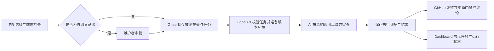

# Triton Anchor CI 产品说明

## 定位与目标

本 CI 为 triton-anchor 的代码合入提供可追溯的验证结果与审查反馈。贡献者可以了解改动实际验证了什么、失败在哪里；审核者可以依据被测提交、检查证据和未完成项判断是否合入；维护者可以查看执行服务与版本环境状态。

本文说明产品实现、设计原则、使用方式和能力边界。部署与配置见 [部署说明](../scripts/local_ci/deploy/README.md)，工具参数见 [工具说明](../scripts/local_ci/tools/README.md)，AI 编排见 [ai_ci_program.md](../scripts/local_ci/ai_ci_program.md)。操作记录与验收过程保存在仓库之外。

## 整体流程

GitHub 完成 PR 信息、Basic CI、API compatibility 和 Security Gate 检查。仅外部贡献者 PR 提供审批入口，审批绑定当时的提交；同仓 PR 通过前置检查后自动继续。Gitee 用于传递任务、代码与结果，不承担授权判断。

Local CI 的 Poller 校验任务身份、选择相应 Triton 环境并启动 AI。AI 理解 PR 意图与影响，自主组织构建、测试和审查；宿主计算最低必检集合，执行工具并保存命令、退出码、日志和产物。AI 的判断必须由实际证据支持。

PR 验证对象是与目标分支合并后的提交，分支推送验证对象是该次提交。PR 关闭、转为草稿、改变目标分支或更新代码后，过期任务和结果不能作为当前合入依据。

## 验证能力与选测原则

| 变更范围 | 最低验证要求 |
| --- | --- |
| 纯文档 | 免构建，完成有源码依据的架构审查 |
| 编译器代码或打包 | 环境、前端构建、安装/import、Frontend smoke、架构审查 |
| 前端代码或测试 | 在上述范围上追加相关前端测试 |
| 后端、lowering、pipeline 或影响不明 | 执行全部适用检查 |
| CI 控制面 | 环境、CI 流程检查、架构审查；混合改动叠加相应编译器检查 |
| 手动 FlagGems 全量任务 | 全部适用检查与全量算子集合 |

前后端的构建、安装、测试和 smoke 可以分别调用。构建依赖环境准备，各自安装使用本任务的构建产物；后端安装还依赖前端安装，以验证 Triton 后端发现。tests 与 smoke 互不依赖，失败能够定位到具体阶段。环境、FlagGems、编译耗时、Pass profiling 和 IR serialization 也有独立工具入口。

仅 Triton 3.0 配置后端、算子与性能能力，其他版本明确记录不适用。3.0 缺少真实 SDK、设备或测试依赖时记录环境阻塞，不能用占位执行替代通过。FlagGems 按改动影响选测，全量保留手动触发。性能变化用于审核参考；测量命令失败仍阻塞，无匹配可信基线时只报告候选测量。

## AI 与工具分工

| 组成 | 职责 |
| --- | --- |
| AI 编排 | 解释意图、分析影响、选择检查、交错开展审查与验证、汇总证据 |
| `tools/basic_tools` | 提供环境、构建、安装、测试和性能的确定性执行能力 |
| `tools/ai_review_tools` | 提供架构契约和 PR 意图专项审查依据 |
| `tools/ai_custom_tools` | 执行当前任务的复现、边界输入生成、IR/诊断分析、基线对比和证据整理脚本 |
| 宿主控制程序 | 约束最低检查、隔离权限、记录事实、核验结果并发布 |

当前 AI 通过常驻容器中的 `codex exec` 调用配置的模型服务，受信配置使用 DeepSeek 官方服务与 `deepseek-v4-flash`。模型及执行预算由维护者配置。AI 优先复用已有工具和测试，成功且仍适用的检查不重复执行；辅助脚本成功不能替代基础工具的必检结果。

自主恢复限于当前任务，例如降低构建并行度、调整任务内用例或重试可恢复操作。长期规则、基础工具、架构契约和容器配方由维护者采纳。PR 文本、源码注释及生成内容均是待分析数据，不能改变执行权限或最低要求。

## 合入反馈与 Dashboard

PR 的四项必要检查为 `local-ci/basic`、`local-ci/api`、`local-ci/security` 和 `local-ci/summary`，仓库规则要求其通过；仓库管理员可在 PR 合入时绕过此要求，检查与审批流程仍照常执行。失败、超时、缺少依赖及必检未完成均不能表现为成功。分支推送和手动全量结果使用独立状态，不覆盖 PR 门禁。

每个 PR 的新提交追加一条 CI 审查评论，同一提交重试更新对应评论。评论标明对应提交，只列出实际执行项目，并提供审查反馈、阻塞项、必要限制和完整结果入口。历史评论不代表最新提交的验证结论；是否满足合入门禁以当前提交的必需检查为准。

Dashboard 分为四个模块：

- **任务与证据**：CI 任务记录、检查结果、AI 审查、阻塞项与执行日志。搜索框输入 PR 编号可精确查找，也支持 `local-ci.html?pr=3`；默认显示当前结果，可切换包含历史记录。
- **Worker 运行状态**：任务阶段与心跳、各 Triton 版本的 CPU/内存、进程数、I/O、启动与维护状态、工作磁盘容量，并提供任务入口。未采集指标不显示为正常。服务可用不等于某个 PR 已通过验证。
- **全量算子测试**：全量算子结果、筛选与下载。
- **后端与性能**：后端状态和性能数据。

“查询最新快照”只获取已发布数据，不重新运行 CI。页面可见时每 5 分钟读取，隐藏时暂停请求。公开 Pages 展示最近发布快照，数据生成时间与读取时间分别标示；心跳超过 15 分钟显示过期，不据此认定主机当前离线。

自动 push 覆盖 `main` 与 `ci_repo`；其他分支通过 PR 或手动入口验证。手动任务由现有 GitHub gateway 发起，全量 FlagGems 选择 full 模式。所有任务均保留提交与环境身份。

## 部署与运行原则

正式部署目标为 Linux、Docker 和 systemd。每个 Triton 版本使用固定常驻容器，任务之间复用；每日维护在窗口内等待任务结束，再按受信配方重建并替换容器。候选代码、AI 会话、控制程序和远端凭据分别隔离，任务结束清理其进程与临时环境，保留验证证据。

`main` 的 workflows 仅保留 `api-breaking-notify.yml`、`ci-gateway.yml`、`ci.yml` 和 `upstream_watch.yml`。完整 CI、嵌入 gateway 的能力声明、PR 模板和 watchdog 实现集中在 `ci_repo`；main 通过现有 gateway 的定时 job 转发健康检查。Local CI 脚本控制面集中在 `scripts/local_ci` 与 `scripts/dashboard`；`runtime` 负责任务投递、执行和结果接收，`deploy` 提供部署与门禁配置入口。

任务轮询为 30 秒，运行任务有效性检查为 10 秒，健康采集和发布为 60 秒。独立 watchdog 每 30 分钟检查一次，GitHub 调度可能延迟；故障类别变化或恢复才通知。通知采用 GitHub 运维 Issue 原生订阅，无需单独发件邮箱，邮件投递由订阅者的 GitHub 设置决定。

任务记录按 PR、push 与目标分支组织，PR 路径包含编号。结果、日志与附件绑定被测提交并校验内容；发布失败重试既有结果，不重复构建。只有实际执行并保存的证据可以支持通过结论。

## 当前验证边界

本机持久 Linux 容器链路用于验证任务传递、前端构建与测试、AI 调用、结果回写和页面展示。真实 Triton 3.0 后端 SDK/设备、后端算子与性能验证，以及独立 Linux 服务器的 systemd 部署验收，仍需要相应环境证据。

外部 PR 的审批策略和内部 PR 跳过路径已有检查；真实外部贡献者发起 PR、等待审批、维护者批准并继续执行的完整动作尚未完成验收。上述边界不能由界面样例、占位配置或前端成功替代。

源码一致性校验用于确认检查结果对应本次提交；环境准备失败或未完成校验时，不应据此认定贡献者修改了被测源码。

外部 PR 的人工审批仅对所核对的提交生效；每次提交更新后，都需要重新确认。
