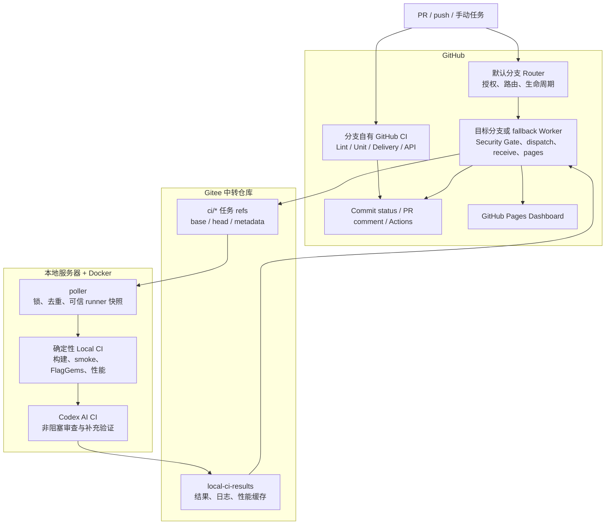
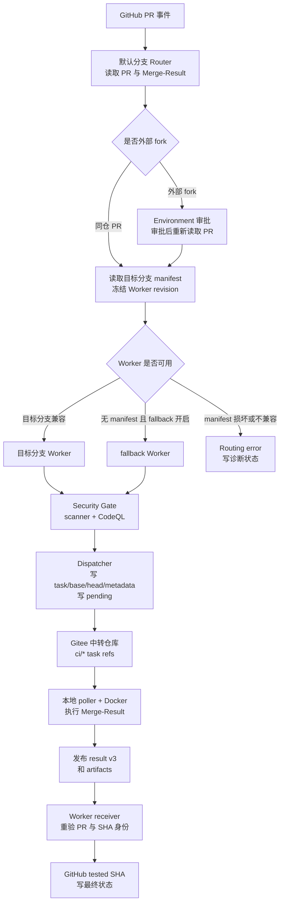

# triton-anchor CI 说明

## 1. 文档目的

本文说明 `triton-anchor` 当前 CI 的架构、任务链路、结果协议、部署配置和日常排查方式。它面向开发者、分支维护者和 CI 维护者：

- 开发者了解 PR、push 和手动 full 任务会运行什么，以及去哪里查看结果；
- 分支维护者了解如何让普通目标分支持有自己的 Worker，并遵守统一 Gateway Contract；
- CI 维护者了解 GitHub、Gitee 中转仓库、本地服务器、Docker、Codex AI 与 GitHub Pages 的边界。

当前系统由三层组成：GitHub 是入口、授权和状态展示面；Gitee 是异步任务与结果中转层；本地 Docker 环境承担依赖 LLVM、PPL、目标后端和运行时的确定性重型测试，并在测试完成后提供一次性 Codex AI 审查所需的临时执行环境。

GitHub-hosted runner 负责 Lint、纯 Python 单测、Delivery 预检、Public API 兼容性、Security Gate 和 Dashboard 构建验证。本地服务器负责确定性 Local CI、FlagGems、性能测量和 Codex AI 补充审查。本文不描述软件包或版本发布流程。

### 1.1 核心术语

| 术语 | 可以怎样理解 |
| --- | --- |
| Router | 默认分支上的调度入口：判断请求是否允许执行、应交给哪个 Worker，但不执行候选代码 |
| Worker | 目标分支上的执行入口：在统一契约下做安全检查、投递任务、接收结果和刷新页面 |
| fallback Worker | 暂时代管还没有 Worker 的目标分支；当前策略默认使用 `CI_dev` |
| Merge-Result | GitHub 临时生成的“PR 代码与目标分支合并后的提交”；PR Local CI 实际测试它 |
| task ref | GitHub 写入 Gitee 的 `ci/*` 分支，告诉本地 poller 应测试哪个精确提交 |
| receiver | GitHub 侧等待并读取 Gitee 结果的 Worker 环节，负责把最终状态写回 GitHub |
| 确定性 Local CI | 有固定输入、固定阶段和可验证退出码的本地测试链路；它决定 Local CI 是否通过 |
| Codex AI CI | 建立在确定性 CI 之后的补充审查与定向验证，不是合入门禁 |

## 2. 总体设计

### 2.1 为什么拆成 GitHub CI 和 Local CI

项目中不依赖目标后端的检查，例如 Ruff、纯 Python 测试、脚本语法、API 对比和 Dashboard 数据契约，适合在 GitHub-hosted runner 上快速执行。前端重装、后端 rebuild、smoke/JIT、FlagGems 和性能测量依赖本地工具链和预置环境，适合由本地服务器长期维护。

GitHub 不主动连接本地服务器。GitHub 把经过校验的精确任务 ref 写入 Gitee；本地 poller 主动轮询并运行；结果发布回 Gitee 后，GitHub receiver 再回写状态、PR 评论和 Pages。

### 2.2 总体流程



### 2.3 关键原则

- 默认分支是稳定控制面：不 checkout 或执行候选代码，不读取 Gitee token；
- 普通目标分支是执行面：可以调整测试内容，但不能自行改变 Gateway Contract、SHA 语义、授权规则和 Secret 边界；
- PR 实际测试 GitHub Merge-Result，而不是单独的 PR head；
- 确定性 Local CI 的最终退出码是 Local CI 的唯一阻塞依据；
- Codex AI 是 advisory，不能替代确定性 CI、Security Gate 或人工审查；
- 结果、状态和 Pages 均以精确 SHA、task ref 与 run ID 关联，旧结果不能覆盖当前 PR；
- 只有指定来源分支可以更新公开 Dashboard；跨分支代跑只回写真实 commit status。

### 2.4 工作流一览

| 工作流 | 文件 | 作用 |
| --- | --- | --- |
| CI Gateway | `.github/workflows/ci-gateway.yml` | Router/Worker 共同入口，负责契约校验、模式分流和跨分支路由 |
| Worker manifest | `.github/ci-gateway-manifest.json` | 声明 Contract 版本、Worker 角色、Merge-Result 和可用能力 |
| Security Gate | `.github/workflows/security-gate.yml` | 可信 scanner、CodeQL 与风险构造检查 |
| CI | `.github/workflows/ci.yml` | Ruff、格式检查和纯 Python 测试 |
| Delivery CI | `.github/workflows/delivery-ci.yml` | CI 脚本预检、性能协议检查和手动容器化 full smoke |
| Public API Compatibility | `.github/workflows/api-compat.yml` | 比较稳定 Python API 并生成 artifact |
| API Breaking Notification | `.github/workflows/api-breaking-notify.yml` | 消费兼容性 artifact，创建、更新或恢复通知 |
| Dispatch Local CI | `.github/workflows/dispatch-local-ci.yml` | 投递 Gitee task/base/head/metadata refs，写 pending，启动 receiver |
| Receive Local CI Result | `.github/workflows/receive-local-ci-result.yml` | 等待结果、重验身份、回写状态和请求 Pages 刷新 |
| Backend Status Pages | `.github/workflows/backend-status-pages.yml` | Dashboard 构建验证、结果同步和单分支部署 |
| Local CI Contracts | `.github/workflows/local_ci.yml` | 当前仅保留手动 contract precheck，不是自动 PR 门禁 |

## 3. 多分支 Gateway

### 3.1 Router、Worker 与 fallback

CI Gateway 将系统拆为默认分支控制面和普通目标分支执行面。可以把 Router 理解为“只负责决定能否执行、交给谁执行的调度台”；Worker 则是“遵守同一调度协议并实际把任务跑完的执行台”。默认分支和 Worker 分支中的 `.github/workflows/ci-gateway.yml` 保持相同的事件、`workflow_dispatch.inputs`、公共 Router jobs 和 Contract 版本；Worker 版本在此基础上增加执行 jobs，是 Router 的严格超集。

| 角色 | 负责 | 不负责 |
| --- | --- | --- |
| 默认分支 Router | `pull_request_target`、外部 fork 审批、Worker 发现、PR 生命周期、手动跨分支 push 路由、早期失败状态 | 执行候选代码、读取 `GITEE_TOKEN`、运行 scanner 或 Local CI |
| 普通目标分支 Worker | Security Gate、dispatcher、receiver、cancel、Pages 和分支自有 GitHub CI | 修改默认分支的授权模型或绕过 Contract |
| fallback Worker | 暂代无 manifest 分支的 PR，以及维护者手动指定的跨分支 push | 自动接管所有普通分支 push、以跨分支结果部署 Dashboard |
| Gitee 中转仓库 | 保存任务 ref、结果、性能缓存和可追溯产物 | 决定 PR 授权或 Worker 选择 |
| 本地 CI 服务器 | 发现任务、固定可信 runner、执行测试和发布结果 | 决定 GitHub 权限、分支保护或路由策略 |

当前部署策略中，默认分支承担 Router，`CI_dev` 是首个完整 Worker 和 fallback Worker。`CI_dev` 是当前策略默认值，而不是 Gateway Contract 中必须写死的业务分支名。

### 3.2 Gateway Contract v3

**当前基线：Gateway Contract v3。** Gateway Contract 是两侧 `ci-gateway.yml` 共同实现的调用协议，不是额外的独立 workflow。默认分支 Router 与目标分支 Worker 必须使用同一版本；Worker manifest 也会声明该版本，Router 在路由前进行校验。

为避免“所有 v3 都是同一协议”的误解，当前涉及的版本分别表示：

| 对象 | 当前版本或形式 | 负责什么 |
| --- | --- | --- |
| Gateway Contract | v3 | Router 与 Worker 的 inputs、mode、SHA 语义、task ref 和权限边界 |
| PR task metadata | v2 | PR 标题、描述、base/head/tested SHA 及文本是否被截断 |
| Codex AI 报告 | `triton-anchor-codex-ai-report/v3` | AI 的语义分析、可信命令事实、finding 与评论渲染输入 |
| 发布结果 | 独立 schema | `result.json`、`publish-manifest.json`、阶段摘要和性能产物的发布/消费协议 |

Gateway Contract v3 固定以下模式：

| mode | 含义 |
| --- | --- |
| `dispatch` | 校验并投递一个 PR Merge-Result 任务 |
| `push` | 由 fallback Worker 代跑某个分支的精确 push SHA |
| `receive` | 继续等待已投递任务，并在回写前重验新鲜度 |
| `pages` | 构建/部署 Dashboard；仅允许 Pages 来源分支 |
| `cancel` | 取消过期 receiver，并按规则清理 relay refs |

| 字段 | 含义 |
| --- | --- |
| `expected_head_sha` | 获得授权的 PR head，用于 force-push 和新鲜度校验 |
| `comparison_base_sha` | Merge-Result 的第一父提交；性能比较和可信 `envsetup.sh` 的来源 |
| `tested_sha` | 实际执行且写 Required status 的提交；PR 为 Merge-Result，push 为分支 head |
| `requested_sha` | 手动 push 的可选防漂移 SHA |
| `worker_revision_sha` | 执行 Gateway、scanner、dispatcher 与 receiver 的精确 Worker 版本 |

PR 的 `refs/pull/<PR号>/merge` 必须存在，第二父提交必须等于 `expected_head_sha`；第一父提交即实际采用的 `comparison_base_sha`。这样测试对象始终是“当前 PR 与当前目标分支的可合并结果”。

修改 Contract 的 inputs、mode、SHA 含义、ref 格式或 Secret 边界时，不能由单个分支直接改动。需要先部署兼容 Worker，再升级默认分支 Router；若无法兼容，应升级 Contract 版本并保留明确的迁移说明。

### 3.3 PR 自动链路



图中省略了 merge parent、metadata schema 和 receiver 的逐字段校验；这些规则由本节上下文和后续结果协议章节说明。图只强调授权、Worker 选择、投递、执行和回写五个关键阶段。

外部 fork 会进入 `LOCAL_CI_FORK_APPROVAL_ENVIRONMENT` 对应的 GitHub Environment。该 Environment 只有配置 Required reviewers 时才构成真正的人工门禁；没有 reviewer 时 GitHub 会自动继续。审批后或手动 dispatch 后，Gateway 会重新读取当前 head 和 Merge-Result，因此 force-push、retarget、关闭或转 draft 会使旧审批和旧结果失效。

目标分支没有 manifest 且 `LOCAL_CI_FALLBACK_PR_ENABLED=true` 时，Router 才会使用 `LOCAL_CI_FALLBACK_WORKER_BRANCH`。manifest 已存在但 JSON 损坏、Contract 不兼容、能力不足或必要文件缺失时必须明确失败，不能静默 fallback。

### 3.4 Push、receiver 与 Pages

- 自持 Worker 分支的 push 运行本分支 Worker，并写入 `ci/push/<branch>`；
- 无 Worker 分支的 push 不会自动代跑。维护者可在默认分支 Gateway 手动选择 `mode=push` 并填写 `source_branch`；
- 手动 push actor 需要 `write`、`maintain` 或 `admin` 权限。填写 `requested_sha` 时，它必须等于当前分支 head；
- receiver 把状态写回真实 source branch commit。跨分支代跑只更新 status，不刷新 Dashboard；
- 只有 `LOCAL_CI_PAGES_BRANCH` 的 push 或 full 结果能通过 `mode=pages` 更新生产 Dashboard。

`Backend Status Pages` 既用于 Dashboard 代码与数据契约验证，也作为 Gateway `mode=pages` 的可复用 Worker。正式页面刷新由 receiver 在结果发布后通过 Gateway 发起；部署仍只允许配置的 Pages 来源分支。

## 4. GitHub 侧 CI

### 4.1 基础 CI

`.github/workflows/ci.yml` 在持有它的分支 push 和 PR 上运行：

- `Lint & Style`：Ruff 静态规则与格式检查；
- `Unit Tests (pure Python)`：Python 3.9、3.10、3.11、3.12 矩阵，覆盖 `python/triton_anchor/tests/`；
- Python 3.10 任务生成 `coverage.xml`。

这层检查不依赖目标后端，适合快速发现 Python 逻辑、数据模型、Adapter 注册、IR 校验和工具脚本回归。

### 4.2 Delivery CI 与手动 full smoke

`delivery-precheck` 提前检查 CI 本身是否可执行：关键 Shell 脚本执行 `bash -n`，构建/性能/发布 Python 脚本执行编译或导入检查，并运行纯 Python 前端与性能协议测试。

容器化 `delivery-full-smoke` 只在手动设置 `run_full_smoke=true` 时运行。它适合验证 Docker 构建环境、排查本地环境差异或检查 `frontend-only`、Sophgo CModel 和 custom profile，不作为日常 PR 的默认重型门禁。

### 4.3 Public API Compatibility 与通知

`api_contract/public_api.json` 定义稳定 Python API 范围。`api-compat.yml` 使用 AST 比较基准与候选，识别模块/导出删除、函数参数不兼容、dataclass 或 enum 变化和抽象接口破坏等问题。

- PR 比较 base 与 PR head；push 比较 push 前后版本；
- 输出 Job Summary、JSON、Markdown 与 `public-api-compatibility` artifact；
- 存在 breaking change 时兼容性 job 失败；warning 不单独阻断；
- 默认分支的 `api-breaking-notify.yml` 只消费经过 schema/head 校验的 artifact，在 PR 或 commit 上创建/更新固定标记评论；恢复 compatible 后更新为 resolved。

### 4.4 Security Gate

Security Gate 位于 Worker 执行链，在 dispatcher 使用 Gitee 写凭据之前运行。它使用精确 `worker_revision_sha` 的可信 scanner 与 CodeQL，重点拦截凭据泄漏、不受控网络访问和危险执行方式等风险构造。

Security Gate 通过不等于候选代码完全可信，而是满足“允许将冻结任务交给隔离边界有限的 Local CI”这一前置条件。外部 fork 仍必须先经过 Environment 审批。

## 5. Local CI

### 5.1 任务 ref、metadata 与结果目录

| 类型 | Gitee ref | poller 是否直接执行 | 用途 |
| --- | --- | --- | --- |
| PR task | `ci/pr-<PR号>/<source-branch>` | 是 | 指向 GitHub test Merge-Result |
| PR base | `ci/base/pr-<PR号>/<source-branch>` | 否 | 性能基线、可信 base 与 diff 身份 |
| PR head | `ci/head/pr-<PR号>/<source-branch>` | 否 | 精确贡献者 head，供 metadata 和 Codex diff 使用 |
| PR metadata | `ci/meta/pr-<PR号>/<source-branch>` | 否 | `task-metadata.json` v2 |
| push | `ci/push/<branch>` | 是 | 分支当前精确 push 提交 |
| full | `ci/full/<branch>` | 是 | 手动完整 FlagGems 任务 |
| 结果 | `local-ci-results` | 否 | 结果、产物、性能 cache 与 Dashboard 数据 |

metadata v2 保存 PR 的 title、description、base/head/tested 身份。title 最多 500 字符、description 最多 8000 字符；`title_truncated` 与 `description_truncated` 明确表示是否被裁剪。metadata 缺失不会阻止确定性 CI，但会降低 Codex 对贡献者目标和 PR 描述的理解质量。

结果目录由 `scripts/local_ci/shared/result_paths.py` 固定：

```text
runs/ci_push/ci_push_<branch>/<sha>/<run-id>/
runs/ci_pr/ci_pr-<number>_<branch>/h-<head12>_m-<merge12>/<run-id>/
runs/ci_pr/ci_base_pr-<number>_<branch>/<sha>/<run-id>/
runs/ci_full/ci_full_<branch>/<sha>/<run-id>/
```

PR 目录同时记录贡献者 head 与实际测试 Merge-Result。不同 PR 更新会重用 task ref，但新的 tested SHA 形成新的 run；bridge 只接受仍匹配当前 PR head/base/merge 身份的结果。

### 5.2 poller 与可信 runner

本地服务器的稳定入口是：

```bash
LOCAL_CI_CONFIG=/path/to/local-ci/config.env \
  bash scripts/local_ci/poll_gitee_and_run.sh
```

`poll_gitee_and_run.sh` 负责读取配置、扫描 Gitee refs、加锁、去重、冻结可信脚本、准备 PR base/head/metadata、性能 baseline 预热、运行确定性 CI 与 Codex，并在成功发布后推进 processed SHA。

生产建议：

```text
GITEE_POLL_ALL_BRANCHES=1
GITEE_BRANCH_INCLUDE_REGEX=^ci/(pr-[0-9]+/.+|push/.+|full/.+)$
```

`ci/base/*`、`ci/head/*`、`ci/meta/*` 与 `local-ci-results` 不会被当作普通执行任务。每个新 SHA 都有独立 run ID、日志和可信 runner 快照；发布失败或任务异常中断不会推进 processed SHA，poller 会在后续轮询重试。

服务器不直接信任 PR 中携带的 Local CI 控制脚本。poller 从 `LOCAL_CI_SCRIPT_DIR` 指向的可信完整 `scripts/local_ci` 目录复制快照到 `LOCAL_CI_STATE_DIR/runner/<run-id>/`，再由 `orchestration/run_deterministic_ci_in_container.sh` 把快照带入容器。

### 5.3 确定性 runner

容器内 `deterministic_ci/run_deterministic_ci.sh` 的典型顺序：

```text
认证并 checkout 精确 SHA
  -> 获取性能 baseline
  -> 清理任务 Gitee 认证
  -> 激活 Python venv
  -> source envsetup
  -> 前端 build / wheel install / import verify
  -> 前端 smoke
  -> 后端环境 / rebuild / discovery
  -> 后端 smoke + JIT
  -> FlagGems sample / full / single
  -> compile-time、pass profile、IR serialization
  -> delivery-summary.txt 和 result.json
```

PR 测试 Merge-Result 代码，但 supervisor 只 source 从精确 comparison base 提取的可信 `envsetup.sh`；候选 `envsetup.sh` 只做独立语法检查。push 任务使用当前 push commit 的版本。

前端 build、前端 smoke、后端 rebuild、后端 smoke/JIT 是必选阶段。任何必选阶段缺失、`not_run`、`running` 或失败时，最终结果必须失败；候选脚本中的 `exit 0` 不能把未执行阶段伪装为 success。

当前端到端验证的 backend profile 是 **Sophgo CModel**。接入其他后端时，必须独立维护 container、运行时、后端命令、FlagGems 范围、性能基线、status context 与 Pages 展示，不能直接沿用 Sophgo 的 whitelist 或阈值。

### 5.4 FlagGems 与性能基线

常规 PR/push 可运行 FlagGems sample；手动 `ci/full/*` 运行完整算子集合。每个 operator 在独立进程中运行，并保存状态、失败阶段、耗时和汇总。

PR 性能比较使用 exact base SHA 的 compile-time、pass profile 和 IR serialization cache。若三类 cache 同时缺失，poller 先运行 base task 预热；base task 显式 `RUN_FLAGGEMS_TESTS=false`，只填充性能基线，不重复运行 FlagGems sample。base task 失败不会阻止 candidate 测试，但 candidate 结果会明确带缺失基线或 warning 风险。

性能 cache 需按 `<sha>/<backend-profile>` 隔离。性能超过阈值或基线不足通常记录 warning；GitHub status 没有 warning 状态，因此仍可能显示 success，必须查看阶段摘要和 comparison artifact。

### 5.5 Local CI 模块边界

| 目录 | 主要职责 |
| --- | --- |
| `poll_gitee_and_run.sh` | 稳定入口：轮询、锁、去重、快照、PR 身份、baseline、串联执行与发布 |
| `orchestration/` | 获取 metadata、创建任务级临时根、复制 runner 快照并启动容器 |
| `deterministic_ci/` | 精确 checkout、构建、smoke、后端、FlagGems、性能和阶段摘要 |
| `deterministic_ci/flaggems/` | sample/full/single 选择、批量执行与汇总 |
| `deterministic_ci/performance/` | 三类 benchmark、比较器和独立 cache namespace |
| `codex_ai/` | 非阻塞 AI 审查、凭据、prompt、schema、报告构建与渲染 |
| `results/` | Gitee 发布、`latest.txt`/manifest、cache/Dashboard 与 GitHub bridge |
| `shared/` | 跨 shell/Python 的路径、metadata、finding、failure-IR 与临时目录协议 |

任务临时目录由 `shared/task_tmp.py` 管理，带 ownership marker，只在安全边界内回收。失败 IR 用于在编译或后端阶段失败时保留当次的 IR 中间表示，便于后续复现和定位；它只收集本次失败命令生成的 `.ttir`、`.linalg`、`.pplir`，不会误收集或清理全局 Triton、pip、uv 或 FlagGems cache。

## 6. Codex AI CI

### 6.1 定位与独立凭据

Codex AI CI 是确定性 Local CI 之后的补充审查：确定性 CI 通过时进行代码审查和定向验证；确定性 CI 失败时优先分析失败阶段、日志、产物与 failure-IR。Codex advisory status 和 PR comment 永远不改变确定性 Local CI 的门禁结论。

启用 `RUN_CODEX_AI_CI=true` 后，Codex 使用独立的 `CODEX_AI_CI_HOME`，不使用 poller 用户个人 `~/.codex`。目录需要 `config.toml` 与 `auth.json`，应使用可独立撤销的 CI 专用 token。

### 6.2 审查与报告链路

```text
冻结 tested/base/head 身份
  -> disposable exact-SHA checkout
  -> changed-files manifest 与 FILE-ID
  -> review context profile
  -> 一次性 Codex 容器
  -> 语义分析 JSON + JSONL 命令账本
  -> canonical v3 report builder
  -> Markdown report / PR comment renderer
```

PR 的执行 checkout 使用 tested Merge-Result；Codex 的代码审查 diff 使用冻结的 `base...head`，以准确表示贡献者改动。review profile 只改变阅读和验证优先级，不缩小 changed-files 覆盖范围。当前 profile 包括 `docs_only`、`local_ci_protocol`、`performance`、`local_ci_control`、`codex_ai_ci_maintenance`、`large_diff` 和 `general`。

Codex 只输出符合 `codex_ai_analysis.schema.json` 的语义分析。runner 从 Git manifest、Codex JSONL、工作区 patch/archive 等可信事实构建 canonical `triton-anchor-codex-ai-report/v3`，再由 renderer 生成报告和评论。无法验证文件或行号的 finding 不会被静默丢弃，而会保留为 `unlocated_findings`，并把 verdict 至少降为 warning。

同一 tested SHA 的 Codex 重跑会更新同一条评论；不同 tested SHA 会保留各自评论。评论展示变更摘要、验证内容、限制、finding 和剩余风险，不展示内部 ID 或机器实现细节。

### 6.3 安全边界与预算

Codex 临时容器不是完整 hostile-code sandbox：它来自已执行候选代码的 Local CI 容器 snapshot，Codex 以 root、联网和 `danger-full-access` 执行，并可能 source 候选 checkout 的 `envsetup.sh`。独立凭据与临时容器降低风险，但不能被描述为“可安全运行任意恶意代码”。

当前默认约束包括最多 30 条测试/构建/lint/诊断命令、2700 秒累计命令预算、3600 秒 hard timeout 和 450 秒报告预留。超限写 constraint warning，不改变确定性 CI exit code。

## 7. 结果、状态与 Dashboard

### 7.1 发布与 GitHub bridge

`publish_gitee_result.py` 通过 allowlist 发布需要公开消费的产物，并写入：

- `publish-manifest.json`：schema、状态、SHA、run ID、context、目录、已复制/缺失文件与 fallback 信息；
- `latest.txt`：某个 commit 目录当前最新 run ID；
- `delivery-summary.txt`、`result.json`、阶段日志、性能报告、Codex 报告与必要 artifact；
- compile-time、pass-profile、IR serialization 的 SHA/profile cache 与 Dashboard 数据。

`bridge_gitee_to_github_status.py` 读取 latest、manifest、summary 与 result，校验 schema、target/tested SHA、run ID 和当前 PR 身份后才写 overall、阶段和 Codex advisory status。新增公开 artifact 时必须同步 publisher allowlist、bridge、Dashboard 与测试。

### 7.2 Required status 语义

正常 PR 的 pending、success、failure、error 主状态统一写到 `tested_sha`，即 GitHub Merge-Result SHA；PR head 只用于授权、Codex diff 和过期检查。

尚未获得可用 Merge-Result 时，例如 merge conflict 或早期路由失败，Gateway 才会在 PR head 写 `<context>/routing` 诊断状态。阶段状态有助于定位，但不能替代整体 Local CI Required status。

| 状态 | 含义 |
| --- | --- |
| `pending` | 任务已投递，Local CI 尚未发布最终结果 |
| `success` | 必选阶段通过；可能仍有性能 warning，需查看 artifact |
| `failure` | 构建、smoke/JIT、FlagGems 或 benchmark 执行失败 |
| `error` | 路由、dispatch、receiver、凭据、结果协议或等待超时异常 |

GitHub commit status 与 Actions run 是不同对象：status context 会被新状态更新，Actions run 是不可变历史。一个早期 Pages run 即使失败，后续 receiver 触发的 `mode=pages` 成功 run 也不会把旧 run 改绿，但会形成实际的新部署。

### 7.3 GitHub Pages 状态页面

Dashboard 从 Gitee `local-ci-results` 同步最新有效结果，生成静态 `dashboard/data/` 后部署。页面包含：

1. 最近一次手动 full FlagGems 算子结果，支持搜索、筛选、失败阶段查看和 CSV/Excel 导出；
2. 指定 Pages 来源分支的后端健康、编译时间、Pass profile 和 IR serialization 摘要。

数据模式：

- `mock`：仓库中的演示数据，用于前端/契约验证；
- `mixed`：后端与性能已同步，但尚无有效 full 结果；
- `live`：full、后端状态和性能均来自实际 Local CI。

PR Pages 入口只验证页面与数据契约，不部署。正式部署只允许 `LOCAL_CI_PAGES_BRANCH` 指定的 Worker 分支，并应由 receiver 在结果发布后请求 `mode=pages`。Dashboard 文件的 direct push 入口仍可独立验证或尝试同步，但它不代表 Local CI 已完成。

## 8. 配置与部署

### 8.1 GitHub 配置

| 类别 | 配置 | 说明 |
| --- | --- | --- |
| Secret | `GITEE_TOKEN` | Worker 写 task refs、receiver/Pages 读结果；Router 不读取它 |
| Secret | `PREBUILT_DOWNLOAD_TOKEN` | 手动 full smoke 下载私有预构建依赖时使用 |
| Variable | `GITEE_RESULTS_OWNER` / `GITEE_RESULTS_REPO` | Gitee 结果仓库 owner 与名称 |
| Variable | `GITEE_USERNAME` | token 的认证用户名，可以不同于 owner |
| Variable | `LOCAL_CI_FALLBACK_WORKER_BRANCH` | 无 Worker 分支的代管 Worker，当前默认策略为 `CI_dev` |
| Variable | `LOCAL_CI_FALLBACK_PR_ENABLED` | 是否自动代管无 manifest PR；未配置时默认 `true` |
| Variable | `LOCAL_CI_FALLBACK_PUSH_ENABLED` | 是否允许维护者手动跨分支 push 代管；未配置时默认 `true` |
| Variable | `LOCAL_CI_PAGES_BRANCH` | 唯一允许部署生产 Dashboard 的分支 |
| Variable | `DASHBOARD_SOURCE_BRANCH` / `DASHBOARD_FULL_TEST_SOURCE_BRANCH` | Dashboard 读取的 push/full task ref |
| Environment | `local-ci-fork-approval` | 外部 fork 审批；Required reviewers 由仓库管理员配置 |
| Environment | `github-pages` | Pages 环境；允许来源分支须与 Pages 策略一致 |

结果仓库属于组织、token 属于个人时，owner 与认证用户名不可机械统一。`GITEE_RESULTS_OWNER` 表示仓库所有者，`GITEE_USERNAME` 表示 token 对应的认证账号；两者应分别按实际仓库权限配置。

### 8.2 本地服务器配置

从模板创建真实配置，真实 token 只保存在服务器：

```bash
cp scripts/local_ci/config.example.env /home/localci/local_ci/config.env
```

生产服务器的关键配置示例：

```bash
GITEE_REPO_URL="https://gitee.com/<results-owner>/triton-anchor-local-ci-results.git"
GITEE_OWNER="<results-owner>"
GITEE_REPO="triton-anchor-local-ci-results"
GITEE_USERNAME="<token-account>"
GITEE_RESULTS_OWNER="<results-owner>"
GITEE_RESULTS_REPO="triton-anchor-local-ci-results"
GITEE_RESULTS_BRANCH="local-ci-results"

LOCAL_CI_CONTAINER="anchor-sophgo-ci-prod"
LOCAL_CI_STATE_DIR="/home/localci/local_ci/local-ci-state"
LOCAL_CI_SCRIPT_DIR="/home/localci/local_ci/control_anchor/triton-anchor/scripts/local_ci"
LOCAL_CI_WORKSPACE_HOST="/home/localci/local_ci/workspace"
CODEX_AI_CI_HOME="/home/localci/local_ci/secrets/codex-ai"
```

容器内 `ANCHOR_DIR` 每次任务都会删除并重新 clone，不能与 backend、LLVM、PPL、FlagGems 或 artifact 目录重叠。`GITEE_BRANCH` 表示本次实际 task ref，只能由 poller 传入，不能固定为某个 Worker 分支。

`config.example.env` 是模板，不会覆盖已有 `config.env`。更新可信脚本或配置后需要重启 poller；下一次任务会使用新的 runner 快照。

### 8.3 安全配置重点

- 自动处理外部 fork 时，优先设置 `LOCAL_CI_ALLOW_WRITE_TOKEN_IN_CONTAINER=0`；必须传入容器 token 时使用最小权限的只读 relay token；
- `CODEX_AI_CI_HOME` 使用专用 CI token，不复制个人 Codex 配置；
- `local-ci-fork-approval` 必须设置 Required reviewers 才是人工审批门禁；
- `github-pages` Environment 的可部署分支必须允许 `LOCAL_CI_PAGES_BRANCH`；
- GitHub Variables 会覆盖代码默认值，迁移仓库后应检查它们是否仍指向旧 owner、旧结果仓库或旧分支。

## 9. 使用方式、定位与维护

### 9.1 日常使用

| 场景 | 操作 | 预期行为 |
| --- | --- | --- |
| 同仓 PR | 正常创建或更新 PR | Router 自动选择目标/fallback Worker，Security Gate 后投递 Merge-Result |
| 外部 fork PR | 等待 `local-ci-fork-approval` 审批 | 审批后重新冻结 head 与 Merge-Result；新 commit 需重新审批 |
| Worker 分支 push | 直接 push | 本分支 Local CI 自动运行 |
| 无 Worker 分支 push | 默认分支 Gateway 选择 `mode=push`，填写 `source_branch` | fallback Worker 代跑精确 head，只回写 status |
| 手动 full FlagGems | 从 Worker dispatch workflow 选择 full 模式 | 写入 `ci/full/<branch>`，完成后刷新 full 结果页面 |
| 手动 full smoke | Delivery CI 设置 `run_full_smoke=true` | 在 GitHub Docker runner 中执行，不依赖本地 poller |

一次扫描：

```bash
LOCAL_CI_CONFIG=/home/localci/local_ci/config.env \
  bash scripts/local_ci/poll_gitee_and_run.sh --once
```

持续轮询：

```bash
LOCAL_CI_CONFIG=/home/localci/local_ci/config.env \
LOCAL_CI_POLL_INTERVAL=60 \
  bash scripts/local_ci/poll_gitee_and_run.sh
```

长期运行应使用 systemd 或其他进程管理器，以便开机启动、失败重启和集中查看日志。

### 9.2 常见定位顺序

1. 查看 GitHub Actions run，确认问题发生于 Router、Security Gate、dispatcher、receiver、Pages 还是普通 GitHub CI；
2. Local CI pending 时，检查 Gitee 对应 `ci/*` ref 是否存在且 SHA 与 run title 一致；
3. 检查 poller 是否运行，并查看 `LOCAL_CI_STATE_DIR` 下的 lock、runner 快照和 task 日志；
4. 检查 `LOCAL_CI_CONTAINER`、workspace、venv 与 backend 路径；
5. 在 `local-ci-results` 中按 `h-<head12>_m-<merge12>` 或 push SHA 查找 `latest.txt`、manifest、summary 和 result；
6. 按阶段查看前端、后端、FlagGems、性能或 Codex 产物；
7. Pages 未更新时，确认 receiver 在 result ready 后请求了 `mode=pages`，并核对 Pages branch、Environment 与 Dashboard source/full refs。

### 9.3 修改 CI 时的最低验证集

`local_ci.yml` 当前是手动入口。修改 Local CI、结果协议、Codex AI 或 Gateway 后，至少在 Linux 环境运行：

```bash
bash -n scripts/local_ci/poll_gitee_and_run.sh
python -m compileall -q scripts/local_ci

python -m pytest \
  scripts/local_ci/codex_ai/tests \
  scripts/local_ci/tests/test_module_layout.py \
  scripts/local_ci/results/tests \
  -v --tb=short

PYTHONPATH=python:scripts/local_ci python -m pytest \
  python/triton_anchor/tests/test_dashboard_contract.py \
  python/triton_anchor/tests/test_dashboard_sync.py \
  python/triton_anchor/tests/test_compile_time_regression.py \
  python/triton_anchor/tests/test_pass_profile_regression.py \
  python/triton_anchor/tests/test_ir_serialization_regression.py \
  -v --tb=short

git diff --check
```

涉及 Docker、symlink、`/tmp`、容器权限或编码差异时，Windows Git Bash 不能替代 Linux/Docker 验证。未执行的验证必须明确记录为未执行，不能写成通过。

修改下列协议时，需要同步检查生产者、消费者和测试：

- Gateway inputs、mode、SHA 语义与 manifest；
- `task-metadata.json`、dispatcher、poller、Codex checkout；
- `result_paths.py` / `path_utils.sh`、publisher、bridge、Dashboard；
- publisher allowlist 与新增 artifact 的公开消费逻辑；
- Codex prompt、schema、JSONL evidence、builder、renderer 和 shell/Python harness。

## 10. 代码索引与当前边界

| 类别 | 位置 |
| --- | --- |
| Gateway 与 manifest | `.github/workflows/ci-gateway.yml`、`.github/ci-gateway-manifest.json` |
| Worker workflows | `.github/workflows/security-gate.yml`、`dispatch-local-ci.yml`、`receive-local-ci-result.yml`、`backend-status-pages.yml` |
| 普通 GitHub CI | `.github/workflows/ci.yml`、`delivery-ci.yml`、`api-compat.yml`、`api-breaking-notify.yml` |
| Local CI 入口与模板 | `scripts/local_ci/poll_gitee_and_run.sh`、`scripts/local_ci/config.example.env` |
| 容器编排与确定性 runner | `scripts/local_ci/orchestration/`、`scripts/local_ci/deterministic_ci/` |
| Codex AI | `scripts/local_ci/codex_ai/` |
| 结果发布与 GitHub bridge | `scripts/local_ci/results/` |
| Local CI 共享协议 | `scripts/local_ci/shared/` |
| Dashboard | `scripts/dashboard/`、`dashboard/` |
| API 契约 | `api_contract/`、`scripts/api_contract/` |

当前完成完整环境配置和端到端验证的 backend profile 是 **Sophgo CModel**。系统已具备多分支 Gateway、Merge-Result Local CI、状态回写、性能比较、Dashboard 和非阻塞 Codex AI 审查能力。其他后端仍需独立完成环境、测试集、性能基线、结果展示和运维验证后，才能视为完成接入。
