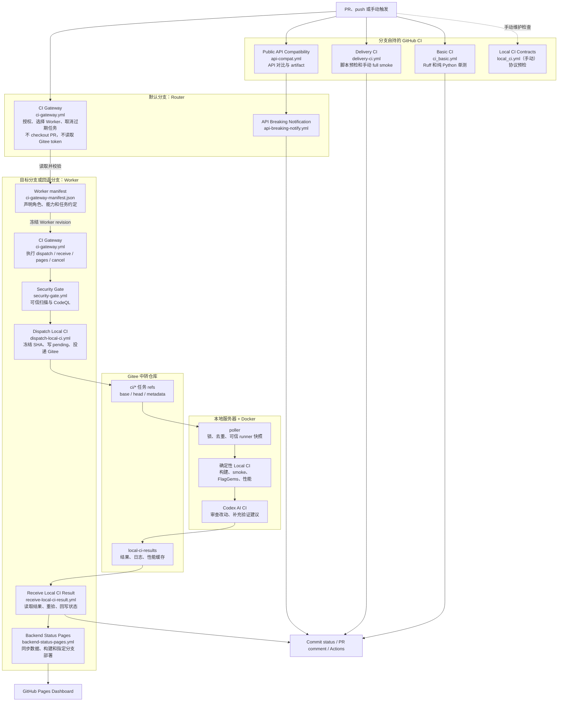
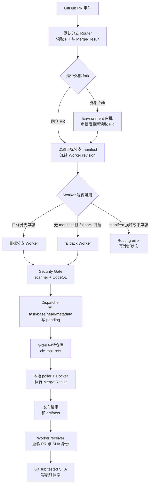

# triton-anchor CI 说明

## 1. 文档目的

本文用于说明 CI 的运行方式和维护边界，主要包含：PR 或 push 从哪里进入、Local CI 如何执行、结果如何回到 GitHub。

开发者可以据此查看检查结果；分支维护者可以据此接入 Worker；CI 维护者可以据此调整 GitHub、Gitee 中转仓库和本地服务器。软件包发布和版本发布不在本文范围内。

系统由三部分组成：GitHub 负责触发、授权和展示状态；Gitee 保存待执行任务和结果；本地 Docker 环境执行依赖 LLVM、PPL、目标后端和运行时的重型测试。Local CI 完成后，Codex AI 会根据改动和测试证据给出补充审查，不改变确定性测试的结论。

### 1.1 核心术语

下面这些词会在后文反复出现，先按运行链路理解即可：

- Router：默认分支上的调度入口，判断任务是否允许执行、应交给哪个 Worker；
- Worker：目标分支上的执行入口，负责安全检查、投递任务、接收结果、取消旧任务和刷新页面；
- fallback Worker：目标分支暂时没有 Worker 时使用的代管分支，由 `LOCAL_CI_FALLBACK_WORKER_BRANCH` 配置；
- Merge-Result：GitHub 为 PR 生成的临时合并提交，Local CI 实际测试的是这个提交；
- task ref：GitHub 写入 Gitee 的 `ci/*` 分支，用来告诉本地 poller 要测试哪个精确提交；
- receiver：GitHub 侧等待并读取 Gitee 结果的环节，负责重验身份并回写最终状态；
- 确定性 Local CI：有固定输入、固定阶段和可验证退出码的本地测试链路；
- Codex AI CI：确定性 Local CI 之后的补充审查和验证建议，不替代门禁结论。

## 2. 总体设计

### 2.1 为什么拆成 GitHub CI 和 Local CI

为了把“快速、通用的检查”和“依赖本地重型环境的检查”分开，将CI拆成两层。Ruff、纯 Python 测试、脚本预检和 API 对比在 GitHub-hosted runner 上能快速完成，适合作为每次 PR/push 都先跑的基础反馈。

前端重装、后端 rebuild、smoke/JIT、FlagGems 和性能测量依赖 LLVM、PPL、目标后端、预置数据和较长运行时间，更适合放在长期维护的本地 Docker 环境里。这样既避免把复杂工具链塞进 GitHub runner，也能让本地服务器复用已有环境、缓存和硬件资源。

GitHub 不直接连接本地服务器：GitHub 写入 Gitee task ref，本地 poller 轮询并执行，结果回到 Gitee 后再由 GitHub receiver 回写状态和页面数据。

### 2.2 总体流程



默认分支只运行 Router；安全扫描、Gitee 投递、结果接收和 Pages 都由被选中的 Worker 分支执行。图中的节点与下面的文件一览一一对应，箭头只表示主调用关系，并不表示所有工作流会在同一次 PR 或 push 中同时运行。

### 2.3 工作流一览

排查或调整 CI 时，可先用这张表定位对应文件，再回到后续章节确认运行边界。

| 工作流 | 文件 | 作用 |
| --- | --- | --- |
| CI Gateway | `.github/workflows/ci-gateway.yml` | Router/Worker 共同入口，负责契约校验、模式分流、取消和跨分支路由 |
| Worker manifest | `.github/ci-gateway-manifest.json` | 声明 Worker 角色、Merge-Result 和可用能力 |
| Security Gate | `.github/workflows/security-gate.yml` | 可信 scanner、CodeQL 与风险构造检查 |
| Basic CI | `.github/workflows/ci_basic.yml` | Ruff、格式检查和纯 Python 测试 |
| Delivery CI | `.github/workflows/delivery-ci.yml` | CI 脚本预检、性能协议检查和手动容器化 full smoke |
| Public API Compatibility | `.github/workflows/api-compat.yml` | 比较稳定 Python API 并生成 artifact |
| API Breaking Notification | `.github/workflows/api-breaking-notify.yml` | 消费兼容性 artifact，创建、更新或恢复通知 |
| Dispatch Local CI | `.github/workflows/dispatch-local-ci.yml` | 投递 Gitee task/base/head/metadata refs，写 pending，启动 receiver |
| Receive Local CI Result | `.github/workflows/receive-local-ci-result.yml` | 等待结果、重验身份、回写状态和请求 Pages 刷新 |
| Backend Status Pages | `.github/workflows/backend-status-pages.yml` | Dashboard 构建验证、结果同步和单分支部署 |
| Local CI Contracts | `.github/workflows/local_ci.yml` | 当前仅保留手动 contract precheck，不是自动 PR 门禁 |

### 2.4 关键原则

以下原则用于明确 Router、Worker 与本地服务器的职责边界：

- 默认分支负责路由和授权；Worker 负责安全检查、投递、接收结果、取消旧任务和页面刷新。
- PR Local CI 测试 GitHub 生成的 Merge-Result；普通 push 测试该分支的当前提交。
- Local CI 是否通过由必选阶段的最终退出码决定；Codex AI 只提供补充审查。
- 状态和结果通过 tested SHA、task ref 与 run ID 关联；Dashboard 只接收指定来源分支的结果。

### 2.5 职责分工

日常维护可按以下职责分工处理：

- 默认分支维护者维护 Router 与 Gateway Contract，确保跨分支路由和授权规则稳定；
- Worker 分支维护者维护安全扫描、Local CI worker 文件及本分支的 GitHub CI；
- 本地 CI/服务器维护者维护 poller、容器、结果仓库权限和运行环境。

## 3. 多分支 Gateway

### 3.1 Router、Worker 与 fallback

CI Gateway 把路由和执行拆开。默认分支的 Router 接收 `pull_request_target`，只决定任务能不能跑、交给谁跑；普通目标分支的 Worker 按同一约定把任务真正跑完。

Router 只运行默认分支中的可信代码：不 checkout 或执行 PR 内容，也不读取 `GITEE_TOKEN`。Gitee 凭据只进入 Worker 执行链；PR dispatch 会在 Security Gate 通过后才使用它。

| 角色 | 负责 | 不负责 |
| --- | --- | --- |
| 默认分支 Router | `pull_request_target`、外部 fork 审批、Worker 发现、PR 生命周期、手动跨分支 push 路由、早期失败状态 | 执行候选代码、读取 `GITEE_TOKEN`、运行 scanner 或 Local CI |
| 普通目标分支 Worker | Security Gate、dispatcher、receiver、cancel、Pages 和分支自有 GitHub CI | 修改默认分支授权模型或绕过 Gateway Contract |
| fallback Worker | 暂代无 manifest 分支的 PR，以及维护者手动指定的跨分支 push | 自动接管所有普通分支 push、用跨分支结果部署 Dashboard |
| Gitee 中转仓库 | 保存 task refs、结果、性能缓存和可追溯产物 | 决定 PR 授权或 Worker 选择 |
| 本地 CI 服务器 | 发现任务、固定可信 runner、执行测试和发布结果 | 决定 GitHub 权限、分支保护或路由策略 |

目标分支没有 manifest 时，Router 可将 PR 交给默认 fallback Worker 分支。这个分支名是部署策略，不是 Gateway Contract 中写死的业务分支名。Gitee 只保存 task ref 和结果，本地服务器只负责发现任务、运行测试和发布结果。

### 3.2 Gateway Contract

Gateway Contract 约束默认分支 Router 与目标分支 Worker 的调用方式。两侧 `ci-gateway.yml` 使用相同的 inputs、mode、SHA 含义和 task ref 格式；manifest 用来声明一个分支是否提供相应 Worker 能力。

契约带有兼容版本字段：Gateway 使用 `GATEWAY_CONTRACT_VERSION`，manifest 使用 `gateway_contract_version`。它用于拒绝接口不一致的分支，不作为本文的架构版本名称。修改 inputs、mode、SHA 含义、ref 格式或 Secret 边界时，先让 Worker 兼容，再更新默认分支 Router。

Gateway Contract 固定以下模式：

| mode | 含义 |
| --- | --- |
| `dispatch` | 校验并投递一个 PR Merge-Result 任务 |
| `push` | 由 fallback Worker 代跑某个分支的精确 push SHA |
| `receive` | 继续等待已投递任务，并在回写前重验新鲜度 |
| `pages` | 构建/部署 Dashboard；仅允许 Pages 来源分支 |
| `cancel` | 取消过期 receiver，并按规则清理 relay refs |

| 字段 | 含义 |
| --- | --- |
| `expected_head_sha` | 获得授权的 PR head，用于 force-push 和新鲜度校验 |
| `comparison_base_sha` | Merge-Result 的第一父提交；性能比较和可信 `envsetup.sh` 的来源 |
| `tested_sha` | 实际执行且写 Required status 的提交；PR 为 Merge-Result，push 为分支 head |
| `requested_sha` | 手动 push 的可选防漂移 SHA |
| `worker_revision_sha` | 执行 Gateway、scanner、dispatcher 与 receiver 的精确 Worker 版本 |

PR 使用 `refs/pull/<PR号>/merge`：第二父提交对应贡献者 head，第一父提交就是 `comparison_base_sha`。因此 Local CI 测试的是当前 PR 与目标分支的合并结果。

### 3.3 PR 自动链路



外部 fork 进入 `LOCAL_CI_FORK_APPROVAL_ENVIRONMENT`。配置 Required reviewers 后，维护者审批才会继续；未配置 reviewer 时 GitHub 会自动继续。审批后 Gateway 会重新读取当前 head 和 Merge-Result。PR 更新、改目标分支、关闭或转 draft 后，旧任务不会再回写结果。

目标分支有兼容 manifest 时使用自己的 Worker；没有 manifest 且 `LOCAL_CI_FALLBACK_PR_ENABLED=true` 时使用 `LOCAL_CI_FALLBACK_WORKER_BRANCH`。manifest 损坏、能力不足或约定不兼容时，路由直接报错，便于分支维护者修复。

### 3.4 Push、receiver 与 Pages

- 自持 Worker 分支的 push 写入 `ci/push/<branch>` 并由本分支 Worker 处理。
- 无 Worker 分支需要具有 `write`、`maintain` 或 `admin` 权限的维护者在默认分支 Gateway 中选择 `mode=push`，填写 `source_branch`；可选 `requested_sha` 用于确认分支没有在启动前发生变化。
- receiver 将结果写回真实 source branch commit。跨分支代跑不刷新 Dashboard。
- receiver 在结果发布后通过 `mode=pages` 请求页面刷新；只有 `LOCAL_CI_PAGES_BRANCH` 的 push 或 full 结果会部署生产页面。

## 4. GitHub 侧 CI

### 4.1 基础 CI

`.github/workflows/ci_basic.yml` 在持有它的分支 push 和 PR 上运行：

- `Lint & Style`：Ruff 静态规则与格式检查；
- `Unit Tests (pure Python)`：Python 3.9、3.10、3.11、3.12 矩阵，覆盖 `python/triton_anchor/tests/`；
- Python 3.10 任务生成 `coverage.xml`。

这层检查不依赖目标后端，适合快速发现 Python 逻辑、数据模型、Adapter 注册、IR 校验和工具脚本回归。

### 4.2 Delivery CI 与手动 full smoke

`delivery-precheck` 提前检查 CI 本身是否可执行：关键 Shell 脚本执行 `bash -n`，构建/性能/发布 Python 脚本执行编译或导入检查，并运行纯 Python 前端与性能协议测试。

容器化 `delivery-full-smoke` 只在手动设置 `run_full_smoke=true` 时运行。它适合验证 Docker 构建环境、排查本地环境差异或检查 `frontend-only`、Sophgo CModel 和 custom profile，不作为日常 PR 的默认重型门禁。

### 4.3 Public API Compatibility 与通知

`api_contract/public_api.json` 定义稳定 Python API 范围。`api-compat.yml` 使用 AST 比较基准与候选，识别模块/导出删除、函数参数不兼容、dataclass 或 enum 变化和抽象接口破坏等问题。

- PR 比较 base 与 PR head；push 比较 push 前后版本；
- 输出 Job Summary、JSON、Markdown 与 `public-api-compatibility` artifact；
- 存在 breaking change 时兼容性 job 失败；warning 不单独阻断；
- 默认分支的 `api-breaking-notify.yml` 只消费经过 schema/head 校验的 artifact，在 PR 或 commit 上创建/更新固定标记评论；恢复 compatible 后更新为 resolved。

### 4.4 Security Gate

Security Gate 在 dispatcher 使用 Gitee 写凭据前运行。它使用 Worker revision 对应的 scanner 和 CodeQL 检查凭据泄漏、不受控网络访问和危险执行方式。外部 fork 仍需经过 Environment 审批。

## 5. Local CI

### 5.1 任务 ref、metadata 与结果目录

查看 Gitee 侧任务时，需先区分 ref 类型。只有任务 ref 会被 poller 当作待执行任务；base、head、metadata 和结果分支用于提供上下文或保存结果。

| 类型 | Gitee ref | poller 是否直接执行 | 用途 |
| --- | --- | --- | --- |
| PR task | `ci/pr-<PR号>/<source-branch>` | 是 | 指向 GitHub test Merge-Result |
| PR base | `ci/base/pr-<PR号>/<source-branch>` | 否 | 性能基线、可信 base 与 diff 身份 |
| PR head | `ci/head/pr-<PR号>/<source-branch>` | 否 | 精确贡献者 head，供 metadata 和 Codex diff 使用 |
| PR metadata | `ci/meta/pr-<PR号>/<source-branch>` | 否 | `task-metadata.json` |
| push | `ci/push/<branch>` | 是 | 分支当前精确 push 提交 |
| full | `ci/full/<branch>` | 是 | 手动完整 FlagGems 任务 |
| 结果 | `local-ci-results` | 否 | 结果、产物、性能 cache 与 Dashboard 数据 |

metadata 保存 PR 的 title、description 和 base/head/tested SHA，供 Codex 理解本次改动。title 最多 500 字符，description 最多 8000 字符；超出部分会记录为 truncated。

定位结果时，可按 task ref 和 SHA 查找目录。结果目录由 `scripts/local_ci/shared/result_paths.py` 固定：

```text
runs/ci_push/ci_push_<branch>/<sha>/<run-id>/
runs/ci_pr/ci_pr-<number>_<branch>/h-<head12>_m-<merge12>/<run-id>/
runs/ci_pr/ci_base_pr-<number>_<branch>/<sha>/<run-id>/
runs/ci_full/ci_full_<branch>/<sha>/<run-id>/
```

PR 目录同时记录贡献者 head 和实际测试的 Merge-Result。同一 PR 更新后会产生新的 tested SHA 和 run，旧结果不会覆盖新状态。

### 5.2 poller 与可信 runner

本地服务器的稳定入口是：

```bash
LOCAL_CI_CONFIG=/path/to/local-ci/config.env \
  bash scripts/local_ci/poll_gitee_and_run.sh
```

`poll_gitee_and_run.sh` 负责扫描 Gitee refs、加锁去重、准备任务输入、运行 Local CI 和发布结果。

生产建议：

```text
GITEE_POLL_ALL_BRANCHES=1
GITEE_BRANCH_INCLUDE_REGEX=^ci/(pr-[0-9]+/.+|push/.+|full/.+)$
```

`ci/base/*`、`ci/head/*`、`ci/meta/*` 与 `local-ci-results` 不会被当作普通执行任务。每个 run 都有独立日志和 runner 快照；发布失败时 poller 会在后续轮询重试。

poller 从 `LOCAL_CI_SCRIPT_DIR` 复制本地 CI 脚本快照，再由 `orchestration/run_deterministic_ci_in_container.sh` 带入容器。PR 中的控制脚本不会直接作为 supervisor 使用。

### 5.3 确定性 runner

容器内 `deterministic_ci/run_deterministic_ci.sh` 的典型顺序：

```text
认证并 checkout 精确 SHA
  -> 获取性能 baseline
  -> 清理任务 Gitee 认证
  -> 激活 Python venv
  -> source envsetup
  -> 前端 build / wheel install / import verify
  -> 前端 smoke
  -> 后端环境 / rebuild / discovery
  -> 后端 smoke + JIT
  -> FlagGems sample / full / single
  -> compile-time、pass profile、IR serialization
  -> delivery-summary.txt 和 result.json
```

PR 测试 Merge-Result 代码；supervisor 使用 comparison base 中的 `envsetup.sh`，候选版本只做语法检查。push 任务使用当前 push commit 的版本。

前端 build、前端 smoke、后端 rebuild、后端 smoke/JIT 是必选阶段。缺失、未运行、运行中或失败都会使 Local CI 失败。

当前完成端到端验证的 backend profile 是 **Sophgo CModel**。其他后端能否接入仍取决于各自的容器、测试命令、性能基线和页面数据，不能视为已完成同等验证。

### 5.4 FlagGems 与性能基线

常规 PR/push 可运行 FlagGems sample；手动 `ci/full/*` 运行完整算子集合。每个 operator 在独立进程中运行，并保存状态、失败阶段、耗时和汇总。

PR 性能比较使用 exact base SHA 的 compile-time、pass profile 和 IR serialization cache。若三类 cache 同时缺失，poller 先运行 base task 预热；base task 显式 `RUN_FLAGGEMS_TESTS=false`，只填充性能基线，不重复运行 FlagGems sample。base task 失败不会阻止 candidate 测试，但 candidate 结果会明确带缺失基线或 warning 风险。

性能 cache 按 `<sha>/<backend-profile>` 隔离。性能超过阈值或缺少基线会记录 warning；具体原因查看阶段摘要和 comparison artifact。

### 5.5 Local CI 模块边界

排查 Local CI 时，先看任务卡在哪个阶段，再进入对应目录。下面的表不是完整源码索引，只列维护时最常用的边界：

| 目录 | 主要职责 |
| --- | --- |
| `poll_gitee_and_run.sh` | 稳定入口：轮询、锁、去重、快照、PR 身份、baseline、串联执行与发布 |
| `orchestration/` | 获取 metadata、创建任务级临时根、复制 runner 快照并启动容器 |
| `deterministic_ci/` | 精确 checkout、构建、smoke、后端、FlagGems、性能和阶段摘要 |
| `deterministic_ci/flaggems/` | sample/full/single 选择、批量执行与汇总 |
| `deterministic_ci/performance/` | 三类 benchmark、比较器和独立 cache namespace |
| `codex_ai/` | 补充 AI 审查、独立凭据、报告生成与发布 |
| `results/` | Gitee 发布、`latest.txt`/manifest、cache/Dashboard 与 GitHub bridge |
| `shared/` | 跨 shell/Python 的路径、metadata、finding、failure-IR 与临时目录协议 |

任务级临时目录由 `shared/task_tmp.py` 管理，带 ownership marker，只在安全边界内回收。编译或后端阶段失败时，failure-IR 只保留本次失败命令生成的 `.ttir`、`.linalg`、`.pplir`，让定位时看到的 IR 与本次失败直接对应；它不会误收集或清理全局 Triton、pip、uv 或 FlagGems cache。

## 6. Codex AI CI

Codex AI 在确定性 Local CI 完成后运行，给 PR 增加一层围绕实际改动和测试证据的审查，帮助开发者更快看懂改动、风险和验证情况。确定性 Local CI 仍是合入门禁，Codex 提供审查和排查辅助。

### 6.1 审查依据

PR 任务会冻结 base、head 和 tested SHA，再把 PR 描述、代码差异、确定性 CI 日志和失败产物交给 Codex。它据此梳理贡献者要解决的问题、改动实际覆盖的行为，并在测试失败时结合失败阶段帮助缩小排查范围。

PR 使用 Merge-Result 时，审查和确定性 Local CI 对应同一个 tested SHA；代码审查的差异范围仍是被冻结的 base 到 head。这让评论能同时回答“贡献者改了什么”和“合并到目标分支后实际测试了什么”。

### 6.2 审查结果与历史

结果返回 GitHub 后，PR 会收到一条 Codex 审查评论，内容通常包括：

- 审查摘要和合入建议；
- 贡献者目标、预期效果与当前实现情况；
- 需要处理的问题，以及可信时对应的文件和行；
- 已执行的验证、结果和未覆盖的范围；
- 本次变更文件及其影响概览。

GitHub 同时显示一条 Codex advisory 状态，完整报告和相关证据保存在本次 Local CI 结果中。同一 tested SHA 的重跑会更新对应评论；PR 产生新的 tested SHA 后，会保留新的评论，便于结合每次测试结果查看历史。

### 6.3 与 Local CI 的边界

确定性 Local CI 先完成构建、smoke、FlagGems 和性能阶段，再把已有证据交给 Codex。确定性 CI 失败时，Codex 仍可提供失败定位和后续验证建议；Codex 本身不可用、超时或报告无法生成时，会留下提示和产物，最终门禁结论仍由必选阶段决定。

启用 `RUN_CODEX_AI_CI=true` 后，服务使用独立的 `CODEX_AI_CI_HOME` 和 CI 专用 token，不复用开发者个人的 Codex 配置。临时工作区与独立凭据让 CI 审查环境更容易管理和撤销；本地服务器仍应作为受信任的 CI 执行环境，而不是用来运行任意恶意代码的隔离沙箱。

## 7. 结果、状态与 Dashboard

### 7.1 发布与 GitHub bridge

`publish_gitee_result.py` 将 `result.json`、阶段日志、性能报告、Codex 报告和 Dashboard 数据发布到 `local-ci-results`。`bridge_gitee_to_github_status.py` 读取这些结果，确认 SHA、run ID 和 PR 身份仍然匹配后，再写 GitHub status。

### 7.2 Required status 语义

正常 PR 的 pending、success、failure、error 主状态统一写到 `tested_sha`，即 GitHub Merge-Result SHA；PR head 只用于授权、Codex diff 和过期检查。

尚未获得可用 Merge-Result 时，例如 merge conflict 或早期路由失败，Gateway 才会在 PR head 写 `<context>/routing` 诊断状态。阶段状态有助于定位，但不能替代整体 Local CI Required status。

| 状态 | 含义 |
| --- | --- |
| `pending` | 任务已投递，Local CI 尚未发布最终结果 |
| `success` | 必选阶段通过；可能仍有性能 warning，需查看 artifact |
| `failure` | 构建、smoke/JIT、FlagGems 或 benchmark 执行失败 |
| `error` | 路由、dispatch、receiver、凭据、结果协议或等待超时异常 |

GitHub commit status 会更新为最新状态；Actions run 保留每次执行的历史记录。Pages 的早期失败 run 不会改绿，后续 receiver 触发的成功 run 会创建新的部署记录。

### 7.3 GitHub Pages 状态页面

Dashboard 从 Gitee `local-ci-results` 同步最新有效结果，生成静态 `dashboard/data/` 后部署。页面包含：

1. 最近一次手动 full FlagGems 算子结果，支持搜索、筛选、失败阶段查看和 CSV/Excel 导出；
2. 指定 Pages 来源分支的后端健康、编译时间、Pass profile 和 IR serialization 摘要。

数据模式：

- `mock`：仓库中的演示数据，用于前端/契约验证；
- `mixed`：后端与性能已同步，但尚无有效 full 结果；
- `live`：full、后端状态和性能均来自实际 Local CI。

PR Pages 入口只验证页面与数据。receiver 在结果发布后请求 `mode=pages`；`LOCAL_CI_PAGES_BRANCH` 指定的 Worker 分支负责正式部署。

## 8. 配置与部署

### 8.1 GitHub 配置

| 类别 | 配置 | 说明 |
| --- | --- | --- |
| Secret | `GITEE_TOKEN` | Worker 写 task refs、receiver/Pages 读结果；Router 不读取它 |
| Secret | `PREBUILT_DOWNLOAD_TOKEN` | 手动 full smoke 下载私有预构建依赖时使用 |
| Variable | `GITEE_RESULTS_OWNER` / `GITEE_RESULTS_REPO` | Gitee 结果仓库 owner 与名称 |
| Variable | `GITEE_USERNAME` | token 的认证用户名，可以不同于 owner |
| Variable | `LOCAL_CI_FALLBACK_WORKER_BRANCH` | 无 Worker 分支的代管 Worker 分支；未配置时使用代码默认值 |
| Variable | `LOCAL_CI_FALLBACK_PR_ENABLED` | 是否自动代管无 manifest PR；未配置时默认 `true` |
| Variable | `LOCAL_CI_FALLBACK_PUSH_ENABLED` | 是否允许维护者手动跨分支 push 代管；未配置时默认 `true` |
| Variable | `LOCAL_CI_PAGES_BRANCH` | 唯一允许部署生产 Dashboard 的分支 |
| Variable | `DASHBOARD_SOURCE_BRANCH` / `DASHBOARD_FULL_TEST_SOURCE_BRANCH` | Dashboard 读取的 push/full task ref |
| Environment | `local-ci-fork-approval` | 外部 fork 审批；Required reviewers 由仓库管理员配置 |
| Environment | `github-pages` | Pages 环境；允许来源分支须与 Pages 策略一致 |

结果仓库属于组织、token 属于个人时，`GITEE_RESULTS_OWNER` 填仓库所属组织或用户，`GITEE_USERNAME` 填 token 对应的认证账号。

### 8.2 本地服务器配置

从模板创建真实配置，真实 token 只保存在服务器：

```bash
cp scripts/local_ci/config.example.env /home/localci/local_ci/config.env
```

生产服务器的关键配置示例：

```bash
GITEE_REPO_URL="https://gitee.com/<results-owner>/triton-anchor-local-ci-results.git"
GITEE_OWNER="<results-owner>"
GITEE_REPO="triton-anchor-local-ci-results"
GITEE_USERNAME="<token-account>"
GITEE_RESULTS_OWNER="<results-owner>"
GITEE_RESULTS_REPO="triton-anchor-local-ci-results"
GITEE_RESULTS_BRANCH="local-ci-results"

LOCAL_CI_CONTAINER="anchor-sophgo-ci-prod"
LOCAL_CI_STATE_DIR="/home/localci/local_ci/local-ci-state"
LOCAL_CI_SCRIPT_DIR="/home/localci/local_ci/control_anchor/triton-anchor/scripts/local_ci"
LOCAL_CI_WORKSPACE_HOST="/home/localci/local_ci/workspace"
CODEX_AI_CI_HOME="/home/localci/local_ci/secrets/codex-ai"
```

容器内 `ANCHOR_DIR` 每次任务都会删除并重新 clone，应与 backend、LLVM、PPL、FlagGems 和 artifact 目录分开。`GITEE_BRANCH` 由 poller 传入实际 task ref，不填写 Worker 分支名。

`config.example.env` 是模板，不会覆盖已有 `config.env`。更新可信脚本或配置后需要重启 poller；下一次任务会使用新的 runner 快照。

### 8.3 安全配置重点

- 自动处理外部 fork 时，优先设置 `LOCAL_CI_ALLOW_WRITE_TOKEN_IN_CONTAINER=0`；需要传入容器 token 时使用最小权限的 relay token；
- `CODEX_AI_CI_HOME` 使用专用 CI token，不复制个人 Codex 配置；
- `local-ci-fork-approval` 必须设置 Required reviewers 才是人工审批门禁；
- `github-pages` Environment 的可部署分支必须允许 `LOCAL_CI_PAGES_BRANCH`；
- GitHub Variables 会覆盖代码默认值，迁移仓库后应检查它们是否仍指向旧 owner、旧结果仓库或旧分支。

## 9. 使用方式、定位与维护

### 9.1 日常使用

| 场景 | 操作 | 预期行为 |
| --- | --- | --- |
| 同仓 PR | 正常创建或更新 PR | Router 自动选择目标/fallback Worker，Security Gate 后投递 Merge-Result |
| 外部 fork PR | 等待 `local-ci-fork-approval` 审批 | 审批后重新冻结 head 与 Merge-Result；新 commit 需重新审批 |
| Worker 分支 push | 直接 push | 本分支 Local CI 自动运行 |
| 无 Worker 分支 push | 默认分支 Gateway 选择 `mode=push`，填写 `source_branch` | fallback Worker 代跑精确 head，只回写 status |
| 手动 full FlagGems | 从 Worker dispatch workflow 选择 full 模式 | 写入 `ci/full/<branch>`，完成后刷新 full 结果页面 |
| 手动 full smoke | Delivery CI 设置 `run_full_smoke=true` | 在 GitHub Docker runner 中执行，不依赖本地 poller |

一次扫描：

```bash
LOCAL_CI_CONFIG=/home/localci/local_ci/config.env \
  bash scripts/local_ci/poll_gitee_and_run.sh --once
```

持续轮询：

```bash
LOCAL_CI_CONFIG=/home/localci/local_ci/config.env \
LOCAL_CI_POLL_INTERVAL=60 \
  bash scripts/local_ci/poll_gitee_and_run.sh
```

长期运行应使用 systemd 或其他进程管理器，以便开机启动、失败重启和集中查看日志。

### 9.2 常见定位顺序

常见问题可按以下顺序逐层定位：

1. 查看 GitHub Actions run，确认问题发生于 Router、Security Gate、dispatcher、receiver、Pages 还是普通 GitHub CI；
2. Local CI pending 时，检查 Gitee 对应 `ci/*` ref 是否存在且 SHA 与 run title 一致；
3. 检查 poller 是否运行，并查看 `LOCAL_CI_STATE_DIR` 下的 lock、runner 快照和 task 日志；
4. 检查 `LOCAL_CI_CONTAINER`、workspace、venv 与 backend 路径；
5. 在 `local-ci-results` 中按 `h-<head12>_m-<merge12>` 或 push SHA 查找 `latest.txt`、manifest、summary 和 result；
6. 按阶段查看前端、后端、FlagGems、性能或 Codex 产物；
7. Pages 未更新时，确认 receiver 在 result ready 后请求了 `mode=pages`，并核对 Pages branch、Environment 与 Dashboard source/full refs。

一些常见现象可以先按下面的方向看：

| 现象 | 先检查什么 |
| --- | --- |
| 外部 fork PR 一直等待或直接继续 | `local-ci-fork-approval` 是否配置 Required reviewers；新 commit 会重新走当前授权流程 |
| Gitee 访问或结果仓库异常 | 区分结果仓库 owner 与 token 对应的 `GITEE_USERNAME`，再检查 GitHub Variables 是否覆盖默认值 |
| GitHub workflow 已更新，但本地执行行为仍旧 | 检查 `LOCAL_CI_SCRIPT_DIR` 的可信脚本 checkout、poller 是否已更新并重启；已启动任务继续使用自己的 runner 快照 |
| Pages 有早期失败 run，但页面后来正常 | 确认 receiver 是否随后触发正式 Pages 刷新；历史失败 run 不会自行变绿 |
| 想找 PR 旧提交或旧 Merge-Result 的结果 | 到 Actions 历史和 `local-ci-results` 对应 run 目录查找，PR Checks 只展示当前测试状态 |

### 9.3 修改 CI 时的最低验证集

`local_ci.yml` 当前是手动入口。修改 Local CI、结果协议、Codex AI 或 Gateway 后，至少在 Linux 环境运行：

```bash
bash -n scripts/local_ci/poll_gitee_and_run.sh
python -m compileall -q scripts/local_ci

python -m pytest \
  scripts/local_ci/codex_ai/tests \
  scripts/local_ci/tests/test_module_layout.py \
  scripts/local_ci/results/tests \
  -v --tb=short

PYTHONPATH=python:scripts/local_ci python -m pytest \
  python/triton_anchor/tests/test_dashboard_contract.py \
  python/triton_anchor/tests/test_dashboard_sync.py \
  python/triton_anchor/tests/test_compile_time_regression.py \
  python/triton_anchor/tests/test_pass_profile_regression.py \
  python/triton_anchor/tests/test_ir_serialization_regression.py \
  -v --tb=short

git diff --check
```

涉及 Docker、symlink、`/tmp`、容器权限或编码差异时，在 Linux/Docker 环境验证。确因环境限制无法执行的检查，应在提交说明中说明原因、风险和替代验证；必选检查不能直接省略。

提交前按改动范围补充验证：Gateway 重点核对 inputs、mode、SHA 和 manifest；结果发布重点核对 publisher、bridge 与 Dashboard；Local CI 和 Codex 修改优先运行相应模块的测试。

### 9.4 阅读与排查入口

日常开发先看 PR 的 Checks 和 Actions；Local CI pending 时查 Gitee task ref 与 poller；结果已发布但状态或页面未更新时，查 receiver、Pages run 和 `local-ci-results`。本节的定位顺序足以覆盖大多数首次排查，复杂问题再从对应 workflow、task metadata 和任务日志向下追踪。
